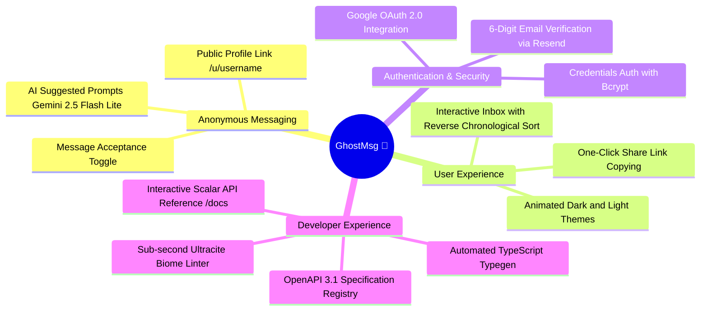

# Chapter 1: Project Overview

GhostMsg is an anonymous messaging platform where users create personal profiles to receive unmoderated, identity-free feedback, confessions, and questions from the public.

---

## 1. Vision & Core Philosophy

In traditional social media platforms, communication is constrained by social anxiety, peer judgment, and public persona. GhostMsg decouples the sender's identity from the message content, enabling candid, honest, and uninhibited interactions.

### Core Tenets
1. **Privacy-First**: No sender IP address, device fingerprints, or account information is stored with submitted messages.
2. **Type Safety & Reliability**: End-to-end type safety from server schemas to client components via Zod, OpenAPI 3.1, and `openapi-fetch`.
3. **Speed & Sub-Second Latency**: Edge runtime execution for AI prompts and cached serverless connections for MongoDB.
4. **Delightful Aesthetics**: Modern dark/light theme, micro-animations via Motion, and responsive layouts built with Tailwind CSS v4.

---

## 2. Ubiquitous Domain Language

GhostMsg adheres strictly to a standardized domain vocabulary:

| Domain Term | Canonical Definition | Avoid Using |
| :--- | :--- | :--- |
| **Anonymous Message** | A piece of text content submitted by an unauthenticated visitor to a user's public profile without disclosing sender identity or metadata. | *Feedback, comment, post, submission, whisper* |
| **Recipient** | A registered user who owns a public profile and receives anonymous messages in their inbox. | *Target, receiver, host, account owner* |
| **Public Profile Link** | A unique, shareable URL path (`/u/[username]`) enabling anyone to send anonymous messages to a specific recipient. | *Inbox link, share link, profile URL, bio link* |
| **Message Acceptance** | A toggleable user preference controlling whether a recipient's public profile is open to receiving new anonymous messages. | *Active status, open inbox, message switch, receiving toggle* |
| **Verification Code** | A temporary, time-limited numerical 6-digit one-time pass code sent via email to confirm ownership of an email address. | *OTP, activation code, auth token, confirm PIN* |
| **Suggested Message** | A generated prompt or question presented to visitors on a recipient's profile to inspire message ideas. | *AI question, template, sample prompt, starter message* |

---

## 3. High-Level Feature Set

---

## 4. Next Chapter
Proceed to [Chapter 2: Getting Started](file:///d:/Projects/GhostMsg/docs/02-getting-started.md) for local environment setup and configuration.
