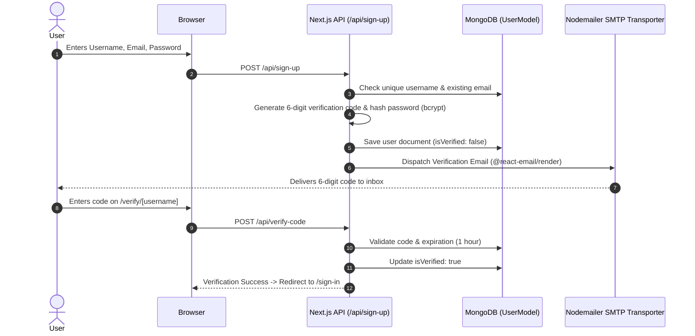

# Chapter 3: System Architecture & Technical Design

This chapter details the high-level system architecture, data models, authentication lifecycle, and runtime boundaries of GhostMsg.

---

## 1. High-Level Architecture Overview

GhostMsg is built on the **Next.js 15 App Router** using React 19, Tailwind CSS v4, MongoDB (Mongoose), NextAuth.js v4, and Google AI Studio.

```
┌─────────────────────────────────────────────────────────────────────────────┐
│                               Client Browser                                │
│          (Landing Page, Dashboard, Profile Link /u/[username], Auth)        │
└───────────────────────┬─────────────────────────────┬───────────────────────┘
                        │ HTTP Requests               │ Edge API Call
                        ▼                             ▼
        ┌──────────────────────────────┐ ┌────────────────────────────┐
        │      Next.js App Router      │ │    Next.js Edge Runtime    │
        │       Node.js Runtime        │ │   /api/suggest-messages    │
        │  - Middleware Authentication │ └─────────────┬──────────────┘
        │  - REST API Routes           │               │
        │  - NextAuth Handlers         │               ▼
        └──────┬───────────────┬───────┘ ┌────────────────────────────┐
               │               │         │ Google AI Studio (Gemini)  │
               ▼               ▼         └────────────────────────────┘
        ┌──────────────┐ ┌──────────────┐
        │   MongoDB    │ │  Nodemailer  │
        │   Database   │ │ (SMTP Mailer)│
        └──────────────┘ └──────────────┘
```

---

## 2. Authentication & Authorization Lifecycle

GhostMsg supports a dual-authentication strategy configured in [`src/app/api/auth/[...nextauth]/options.ts`](file:///d:/Projects/GhostMsg/src/app/api/auth/%5B...nextauth%5D/options.ts).



### Session Management & JWT Payload
- Strategy: JWT (`session: { strategy: 'jwt' }`).
- Token Enrichment: The session token includes `_id`, `username`, `isVerified`, and `isAcceptingMessage`.
- Protected Routes: [`src/middleware.ts`](file:///d:/Projects/GhostMsg/src/middleware.ts) enforces authentication on `/dashboard` and redirects logged-in users away from guest-only auth pages.

---

## 3. Data Model & Storage Design

GhostMsg implements a decoupled relational document model using a dedicated `Message` collection and compound indexing as defined in [ADR 0010](file:///d:/Projects/GhostMsg/docs/adr/0010-standalone-messages-schema-and-feature-architecture.md) (superseding legacy embedded subdocuments).

### Standalone Message Schema (`src/model/message.model.ts`)
```typescript
interface IMessage {
  _id: Types.ObjectId;
  recipientId: Types.ObjectId; // Ref: User (indexed)
  content: string;             // 10-300 chars
  sentimentTag: 'sweet' | 'curious' | 'spicy' | 'advice' | 'neutral';
  isQuarantined: boolean;      // Moderation flag (indexed)
  isPinned: boolean;           // Starred message (indexed)
  isRead: boolean;             // Read tracking
  reply?: {
    text: string;
    isPublished: boolean;      // Public showcase flag (indexed)
    publishedAt?: Date;
  };
  senderHash: string;          // Cryptographic HMAC-SHA256 fingerprint (indexed)
  createdAt: Date;             // Reverse-chronological sort (indexed)
  updatedAt: Date;
}
```

### User Schema (`src/model/user.model.ts`)
```typescript
interface IUser {
  _id: Types.ObjectId;
  username: string;
  email: string;
  password: string;
  verifyCode: string;
  verifyCodeExpiry: Date;
  isVerified: boolean;
  isAcceptingMessage: boolean;
  amaPrompt?: string;          // Custom banner prompt for /u/[username]
  blockedSenderHashes: string[]; // Recipient-level blocked sender fingerprints
  notificationSettings: {
    emailAlerts: "instant" | "daily" | "off";
    webPushEnabled: boolean;
  };
  createdAt: Date;
  updatedAt: Date;
}
```

### Key Database Compound Indexes
* `{ recipientId: 1, isQuarantined: 1, createdAt: -1 }` (Primary Inbox Feed)
* `{ recipientId: 1, isPinned: 1, createdAt: -1 }` (Starred/Favorites Feed)
* `{ recipientId: 1, "reply.isPublished": 1, createdAt: -1 }` (Public Showcase Q&A Feed)

---

## 4. AI & Content Moderation Pipeline

- **Suggested Prompts**: `/api/suggest-messages` (Edge runtime, Gemini 2.5 Flash Lite) generates 3 randomized conversation starters.
- **Synchronous Content Moderation & Sentiment Tagging**: Evaluated on `/api/send-message` ingestion:
  - **Toxicity Check**: Flags harassment or abusive content to set `isQuarantined: true`, isolating the message from the main inbox.
  - **Sentiment Classification**: Labels the emotional tone (`sweet`, `curious`, `spicy`, `advice`, `neutral`).
- **AI Smart Reply Assistant**: `/api/ai/smart-reply` generates multi-tone draft replies (`witty`, `wholesome`, `thoughtful`) directly into the recipient's reply modal.

---

## 5. Privacy, Abuse Prevention & Real-Time Transport

- **In-Memory Rate Limiting**: Upstash Redis sliding window (5 messages per 10 minutes per IP). Raw IPs are never written to MongoDB.
- **Cryptographic Sender Hash**: Computed as $\text{HMAC-SHA256}(\text{IP} + \text{RecipientId},\; \text{SECRET\_SALT})$. Allows recipients to shadowban abusive senders without compromising visitor anonymity.
- **Server-Sent Events (SSE) Live Feed**: Backed by Upstash Redis Pub/Sub channel `recipient:{userId}:messages` streamed over `/api/messages/stream`.
- **Password Hashing & Auth Security**: Bcrypt (rounds = 10), 6-digit verification codes (1-hour expiration), and cached MongoDB connection pooling via [`src/lib/db-connect.ts`](file:///d:/Projects/GhostMsg/src/lib/db-connect.ts).

---

## 6. Master Blueprint & Next Chapter
For the exhaustive implementation specification, see the [Feature & Implementation Master Blueprint](file:///d:/Projects/GhostMsg/docs/feature-and-implementation-blueprint.md).
Proceed to [Chapter 4: API & Type Safety Architecture](file:///d:/Projects/GhostMsg/docs/04-api-and-type-safety.md).
