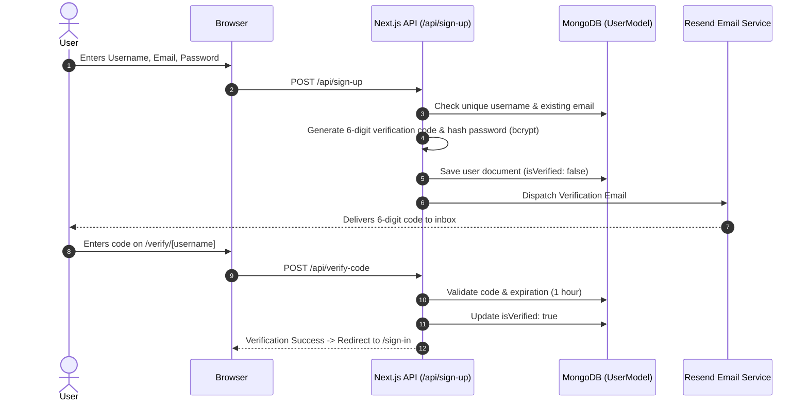

# Chapter 3: System Architecture & Technical Design

This chapter details the high-level system architecture, data models, authentication lifecycle, and runtime boundaries of GhostMsg.

---

## 1. High-Level Architecture Overview

GhostMsg is built on the **Next.js 15 App Router** using React 19, Tailwind CSS v4, MongoDB (Mongoose), NextAuth.js v4, and Google AI Studio.

```
┌─────────────────────────────────────────────────────────────────────────────┐
│                               Client Browser                                │
│          (Landing Page, Dashboard, Profile Link /u/[username], Auth)        │
└───────────────────────┬─────────────────────────────┬───────────────────────┘
                        │ HTTP Requests               │ Edge API Call
                        ▼                             ▼
        ┌──────────────────────────────┐ ┌────────────────────────────┐
        │      Next.js App Router      │ │    Next.js Edge Runtime    │
        │       Node.js Runtime        │ │   /api/suggest-messages    │
        │  - Middleware Authentication │ └─────────────┬──────────────┘
        │  - REST API Routes           │               │
        │  - NextAuth Handlers         │               ▼
        └──────┬───────────────┬───────┘ ┌────────────────────────────┐
               │               │         │ Google AI Studio (Gemini)  │
               ▼               ▼         └────────────────────────────┘
        ┌──────────────┐ ┌──────────────┐
        │   MongoDB    │ │    Resend    │
        │   Database   │ │ Email Service│
        └──────────────┘ └──────────────┘
```

---

## 2. Authentication & Authorization Lifecycle

GhostMsg supports a dual-authentication strategy configured in [`src/app/api/auth/[...nextauth]/options.ts`](file:///d:/Projects/GhostMsg/src/app/api/auth/%5B...nextauth%5D/options.ts).



### Session Management & JWT Payload
- Strategy: JWT (`session: { strategy: 'jwt' }`).
- Token Enrichment: The session token includes `_id`, `username`, `isVerified`, and `isAcceptingMessage`.
- Protected Routes: [`src/middleware.ts`](file:///d:/Projects/GhostMsg/src/middleware.ts) enforces authentication on `/dashboard` and redirects logged-in users away from guest-only auth pages.

---

## 3. Data Model & Storage Design

### Embedded Messages Schema ([`src/model/user.model.ts`](file:///d:/Projects/GhostMsg/src/model/user.model.ts))

Rather than maintaining a separate `messages` collection, messages are stored directly as embedded subdocuments inside the `User` document ([ADR 0001](file:///d:/Projects/GhostMsg/docs/adr/0001-embedded-messages-schema.md)).

```typescript
interface Message {
  _id: Types.ObjectId;
  content: string;
  createdAt: Date;
}

interface User {
  _id: Types.ObjectId;
  username: string;
  email: string;
  password: string;
  verifyCode: string;
  verifyCodeExpiry: Date;
  isVerified: boolean;
  isAcceptingMessage: boolean;
  messages: Message[];
  createdAt: Date;
  updatedAt: Date;
}
```

### Key Database Query Patterns
- **Fetch Inbox Messages**: Uses MongoDB Aggregation Pipeline (`$match` -> `$unwind` -> `$sort` by `messages.createdAt: -1` -> `$group`) for chronological order.
- **Delete Single Message**: Atomic `$pull` on `user.messages` matching `_id`.
- **Send Message**: Pushes new subdocument into `messages` after verifying `isAcceptingMessage === true`.

---

## 4. AI Prompt Generation Pipeline

- **Endpoint**: `/api/suggest-messages`
- **Runtime**: `edge` (Vercel Edge Network)
- **Model**: Google AI Studio `gemini-2.5-flash-lite` via `@ai-sdk/google` & Vercel AI SDK
- **Data Flow**: Streaming response returning 3 engaging prompt ideas delimited by `||` for minimal parsing overhead on the client.

---

## 5. Security & Persistence Model

- **Password Hashing**: Bcrypt with salt rounds = 10 (`bcryptjs`).
- **One-Time Passcode (OTP)**: 6-digit numeric verification code with a 1-hour expiration timestamp.
- **Connection Pooling**: Cached singleton connection in [`src/lib/db-connect.ts`](file:///d:/Projects/GhostMsg/src/lib/db-connect.ts) to prevent MongoDB connection exhaustion during serverless cold starts.
- **Input Sanitization**: Strict Zod schema validation on every inbound request payload before database access.

---

## 6. Next Chapter
Proceed to [Chapter 4: API & Type Safety Architecture](file:///d:/Projects/GhostMsg/docs/04-api-and-type-safety.md).
