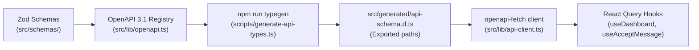

# Chapter 4: API & Type-Safety Architecture

This chapter details GhostMsg's type-safe API infrastructure, single-source-of-truth OpenAPI 3.1 contracts, automatic TypeScript typegen, and client-server communication using `openapi-fetch` and `@tanstack/react-query`.

---

## 1. End-to-End Type Safety Model



---

## 2. Single Source of Truth Contracts

Every parameter, query string, payload, and response is defined with Zod v4 and extended with `@asteasolutions/zod-to-openapi` metadata.

### Example Contract: Sign-Up Request ([`src/schemas/sign-up-schema.ts`](file:///d:/Projects/GhostMsg/src/schemas/sign-up-schema.ts))
```typescript
export const signUpSchema = z
  .object({
    username: usernameValidation,
    email: z.email({ message: "Invalid email address" }).openapi({
      description: "User's email address",
      example: "johndoe@example.com",
    }),
    password: z
      .string()
      .trim()
      .min(6, "password must be atleast 6 characters")
      .openapi({
        description: "Password (minimum 6 characters)",
        example: "SecurePass123!",
      }),
  })
  .openapi("SignUpRequest");
```

---

## 3. Registered Operations Matrix

The OpenAPI registry in [`src/lib/openapi.ts`](file:///d:/Projects/GhostMsg/src/lib/openapi.ts) defines 9 core operations:

| Endpoint | Method | Auth Required | Request Payload / Params | Success Status | Error Statuses |
| :--- | :--- | :--- | :--- | :--- | :--- |
| `/api/check-username-unique` | `GET` | No | Query: `username` | `200 OK` | `400`, `500` |
| `/api/sign-up` | `POST` | No | Body: `SignUpRequest` | `201 Created` | `400`, `500` |
| `/api/verify-code` | `POST` | No | Body: `VerifyCodeRequest` | `200 OK` | `400`, `404`, `500` |
| `/api/send-message` | `POST` | No | Body: `SendMessageRequest` | `200 OK` | `404`, `500` |
| `/api/suggest-messages` | `GET` | No (Edge) | None | `200 OK` | `500` |
| `/api/get-messages` | `GET` | Yes (Session) | None | `200 OK` | `401`, `404`, `500` |
| `/api/delete-message/{messageId}` | `DELETE` | Yes (Session) | Path: `messageId` | `200 OK` | `401`, `404`, `500` |
| `/api/accept-message` | `GET` | Yes (Session) | None | `200 OK` | `401`, `404`, `500` |
| `/api/accept-message` | `POST` | Yes (Session) | Body: `AcceptMessageRequest` | `200 OK` | `400`, `401`, `500` |

---

## 4. Interactive Documentation with Scalar

- **Web UI Route**: [`/docs`](file:///d:/Projects/GhostMsg/src/app/docs/route.ts) mounted with `@scalar/nextjs-api-reference`.
- **Dynamic Spec Endpoint**: [`/api/openapi.json`](file:///d:/Projects/GhostMsg/src/app/api/openapi.json/route.ts) served dynamically from `getOpenApiSpec()`.
- **Capabilities**:
  - Direct "Test Request" console inside the browser.
  - Multi-language SDK code generation (cURL, TypeScript fetch, JavaScript, Python, Go).
  - Searchable schemas, tags, headers, and response formats.

---

## 5. Automated TypeScript Typegen

Running `pnpm typegen` converts the OpenAPI spec into compile-time TypeScript definitions:

```bash
pnpm typegen
```

This generates [`src/generated/api-schema.d.ts`](file:///d:/Projects/GhostMsg/src/generated/api-schema.d.ts) using `openapi-typescript`.

> [!TIP]
> `pnpm build` executes `pnpm typegen` automatically prior to Next.js compilation, guaranteeing zero schema-client drift in CI/CD and production builds.

---

## 6. Client Transport: `openapi-fetch` + React Query Architecture

Axios is deprecated and uninstalled. GhostMsg uses `createClient<paths>()` from `openapi-fetch` wrapped in a throwing `clientFetch` helper in [`src/lib/api-client.ts`](file:///d:/Projects/GhostMsg/src/lib/api-client.ts) alongside domain `queryOptions` and custom mutation hooks as established in [ADR 0006](file:///d:/Projects/GhostMsg/docs/adr/0006-standardized-api-calling-and-react-query-architecture.md).

For complete implementation blueprints, query key hierarchies, and optimistic update recipes, see [API & React Query Architecture Blueprint](file:///d:/Projects/GhostMsg/docs/api-and-react-query-architecture.md).

---

## 7. Next Chapter
Proceed to [Chapter 5: Component Architecture & UI](file:///d:/Projects/GhostMsg/docs/05-component-architecture.md).

