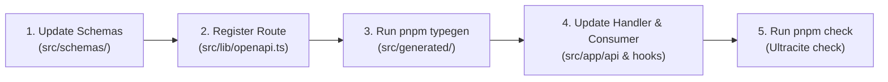

# Chapter 6: Developer Workflow & Tooling

This chapter covers the daily development commands, typegen automation, git pre-commit hooks, and Changeset release workflows.

---

## 1. Daily Development Commands

| Command | Action | Description |
| :--- | :--- | :--- |
| `pnpm dev` | Start Dev Server | Next.js dev server with Turbopack at `http://localhost:3000`. |
| `pnpm typegen` | Generate API Types | Runs `scripts/generate-api-types.ts` to sync `src/generated/api-schema.d.ts`. |
| `pnpm test` | Run Unit & Component Tests | Executes Vitest unit and React 19 component testing suite once. |
| `pnpm test:watch` | Test Watch Mode | Runs Vitest in interactive watch mode during active development. |
| `pnpm test:coverage` | Generate Coverage Report | Generates V8 code coverage report in `coverage/`. |
| `pnpm check` | Lint & Format Check | Ultracite / Biome validation across all 100+ files. |
| `pnpm fix` | Auto-Fix Formatting | Automatically fixes all linting and style errors in sub-seconds. |
| `pnpm build` | Production Build | Automatically runs `typegen` and builds production Turbopack bundle. |
| `pnpm start` | Start Production | Runs the built Next.js server locally. |

---

## 2. API Modification Workflow

When adding or updating any API endpoint, follow the standard workflow:



---

## 3. Git Pre-Commit Automation (Husky)

GhostMsg uses **Husky** with a custom pre-commit hook in [`.husky/pre-commit`](file:///d:/Projects/GhostMsg/.husky/pre-commit):
- Scans all staged code, documentation, and stylesheet files.
- Executes `npx ultracite fix` on staged files.
- Automatically re-stages formatted files before commit.
- Prevents unformatted code or syntax violations from entering git history.

---

## 4. Release Management with Changesets

GhostMsg uses **Changesets** (`@changesets/cli`) for versioning and automated changelog generation:

```bash
# Document a change in your branch
npx changeset

# Bump version and update CHANGELOG.md
npx changeset version

# Publish / tag release
npx changeset tag
```

---

## 5. Next Chapter
Proceed to [Chapter 7: Testing Strategy](file:///d:/Projects/GhostMsg/docs/07-testing-strategy.md).
