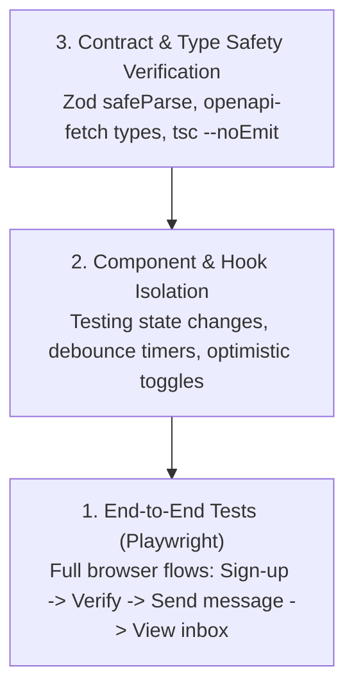

# Chapter 7: Testing Strategy

This chapter details the testing philosophy, end-to-end testing with Playwright, component test mocks, and continuous integration validation.

---

## 1. Testing Hierarchy



---

## 2. Playwright E2E Testing

GhostMsg uses **Playwright** for multi-browser end-to-end validation across Chromium, Firefox, and WebKit.

### Test Structure ([`src/tests/`](file:///d:/Projects/GhostMsg/src/tests))
- **Auth Flows**: Registration, duplicate username blocking, email code verification.
- **Messaging Flow**: Submitting anonymous messages on `/u/[username]`, AI prompt clicks.
- **Dashboard Flow**: Loading inbox messages, copying share link, deleting messages, toggling message acceptance.

### Running Playwright Tests
```bash
# Run all Playwright tests
npx playwright test

# Run tests in interactive UI mode
npx playwright test --ui

# View HTML test execution report
npx playwright show-report
```

---

## 3. Mock Data & Fixtures

Mock fixtures are located in [`src/mock/`](file:///d:/Projects/GhostMsg/src/mock) for predictable, isolated testing without requiring external live database connections or third-party email deliveries during unit tests.

---

## 4. Next Chapter
Proceed to [Chapter 8: Code Quality & Standards](file:///d:/Projects/GhostMsg/docs/08-code-quality.md).
