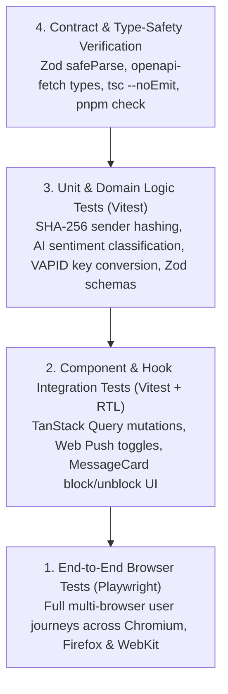

# Chapter 7: Testing Strategy & Vitest Unit Test Architecture

This chapter details GhostMsg's multi-tiered testing strategy: **Vitest Unit & Integration Tests** for fast feedback, **Playwright End-to-End Tests** for full browser flows, and **OpenAPI Contract Testing**.

---

## 1. Multi-Tiered Testing Hierarchy



---

## 2. Vitest Unit & Integration Suite

GhostMsg uses **Vitest** for fast unit and integration testing.

### Key Test Coverage Domains

1. **Security & Cryptography ([`src/lib/security.ts`](file:///d:/Projects/GhostMsg/src/lib/security.ts))**:
   - Verification of `senderHash` HMAC SHA-256 calculation for recipient blocklists.
   - Rate limit calculation algorithms.
2. **AI Moderation & Smart Reply ([`src/lib/ai-moderation.ts`](file:///d:/Projects/GhostMsg/src/lib/ai-moderation.ts), [`src/lib/ai-smart-reply.ts`](file:///d:/Projects/GhostMsg/src/lib/ai-smart-reply.ts))**:
   - Sentiment classification tagging (`sweet`, `curious`, `spicy`, `advice`, `neutral`).
   - Toxicity quarantine detection rules.
   - Multi-tone smart reply fallback generation on AI failure.
3. **Email & Email Templates ([`src/lib/mailer.ts`](file:///d:/Projects/GhostMsg/src/lib/mailer.ts))**:
   - Nodemailer transporter configuration.
   - `@react-email/render` HTML compilation for OTP verification and new message alerts.
4. **Browser Web Push Utilities ([`src/components/dashboard/settings-tab.tsx`](file:///d:/Projects/GhostMsg/src/components/dashboard/settings-tab.tsx))**:
   - `urlBase64ToUint8Array` VAPID public key conversion to `BufferSource` (`Uint8Array`).
5. **OpenAPI & Zod Contracts ([`src/schemas/`](file:///d:/Projects/GhostMsg/src/schemas/))**:
   - Validation contract tests for `sendMessageSchema`, `blockSenderSchema`, `notificationSettingsSchema`, and `publicAnswersResponseSchema`.
6. **Custom Mutation Hooks ([`src/hooks/mutations/`](file:///d:/Projects/GhostMsg/src/hooks/mutations/))**:
   - `useBlockSenderMutation` & `useUnblockSenderMutation` (query key invalidation on success).
   - `useNotificationSettingsMutation` & `usePushSubscriptionMutation`.

### Running Vitest Unit Tests
```bash
# Run unit tests once
pnpm test

# Run unit tests in watch mode
pnpm test:watch

# Generate code coverage report
pnpm test:coverage
```

---

## 3. Playwright E2E Testing

GhostMsg uses **Playwright** for multi-browser end-to-end validation across Chromium, Firefox, and WebKit.

### Test Structure ([`src/tests/`](file:///d:/Projects/GhostMsg/src/tests))
- **Auth Flows**: Registration, duplicate username blocking, email code verification.
- **Messaging Flow**: Submitting anonymous messages on `/u/[username]`, AI prompt clicks.
- **Dashboard Flow**: Loading inbox messages, copying share link, deleting messages, toggling message acceptance.

### Running Playwright Tests
```bash
# Run all Playwright tests
npx playwright test

# Run tests in interactive UI mode
npx playwright test --ui

# View HTML test execution report
npx playwright show-report
```

---

## 4. Architectural Decision Record
For the full rationale, mocking strategy, and scope matrix, see [ADR 0012: Vitest Unit & Integration Testing Strategy](file:///d:/Projects/GhostMsg/docs/adr/0012-vitest-unit-and-integration-testing-strategy.md).

---

## 5. Next Chapter
Proceed to [Chapter 8: Code Quality & Standards](file:///d:/Projects/GhostMsg/docs/08-code-quality.md).
