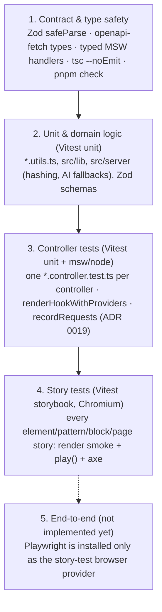
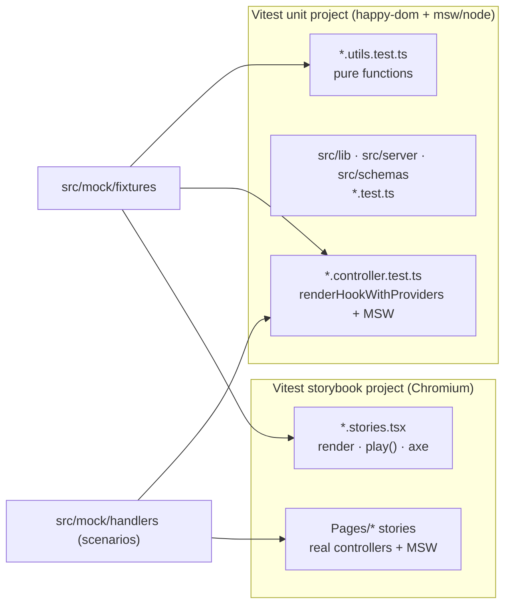

# Chapter 7: Testing Strategy & Test Architecture

GhostMsg runs **two Vitest projects** from one `vitest.config.ts`:
- **`unit`** (happy-dom, MSW-isolated) for logic, controllers and page integration.
- **`storybook`** (Vitest browser mode, headless Chromium, axe) for every component and page story.

Contracts are verified at compile time through Zod + OpenAPI typegen. Rationale: [ADR 0012](file:///d:/Projects/GhostMsg/docs/adr/0012-vitest-unit-and-integration-testing-strategy.md) (Vitest) and [ADR 0016](file:///d:/Projects/GhostMsg/docs/adr/0016-storybook-msw-and-story-driven-component-testing.md) (stories as tests, MSW).

---

## 1. Testing hierarchy


```mermaid
flowchart TD
    CONTRACT["1. Contract & type safety<br/>Zod safeParse · openapi-fetch types · typed MSW handlers · tsc --noEmit · pnpm check"]
    UNIT["2. Unit & domain logic (Vitest unit)<br/>*.utils.ts, src/lib, src/server (hashing, AI fallbacks), Zod schemas"]
    INTEG["3. Controller tests (Vitest unit + msw/node)<br/>one *.controller.test.ts per controller · renderHookWithProviders · recordRequests (ADR 0019)"]
    STORIES["4. Story tests (Vitest storybook, Chromium)<br/>every element/pattern/block/page story: render smoke + play() + axe"]
    E2E["5. End-to-end (not implemented yet)<br/>Playwright is installed only as the story-test browser provider"]

    CONTRACT --> UNIT --> INTEG --> STORIES -.-> E2E
```

> **E2E status:** there is no E2E suite (`src/tests/` and `playwright.config.*` don't exist). `playwright` and `@vitest/browser-playwright` are dependencies only so story tests can drive Chromium. Adding E2E would need its own ADR.

---

## 2. Projects, ownership and commands

| Project | Environment | Includes | Owns |
| :--- | :--- | :--- | :--- |
| `unit` | happy-dom at `http://localhost:3000` + `msw/node` (`onUnhandledRequest: "error"`) | `src/**/*.{test,spec}.{ts,tsx}` | `src/lib`, `src/server`, schemas, `*.utils.ts`, page controllers |
| `storybook` | Chromium via `@vitest/browser-playwright`, `testTimeout: 30_000` | every `src/components/**/*.stories.tsx` (via `storybookTest({ configDir: ".storybook" })`) | All element, pattern, block and page UI behaviour + a11y |

**Ownership rule (ADR 0016, Q9).** Component behaviour lives in story `play()` functions. A `*.test.tsx` next to an element, pattern or block is a duplicate: move its assertions into the story and delete it.

**Network rule (Q11).** No test may reach the real network. Both projects answer HTTP from the same handlers in `src/mock/handlers/`.

```bash
pnpm test             # unit project (fast inner loop)
pnpm test:watch       # unit project, watch mode
pnpm test:coverage    # unit project + V8 coverage (excludes stories, mocks, src/mock, src/test, generated)
pnpm test:stories     # storybook project (first time: pnpm exec playwright install chromium)
pnpm test:all         # both projects — the pre-push gate
```

---

## 3. Current unit test inventory

Tests are **always colocated** (`x.ts` + `x.test.ts`); there are no `__tests__/` folders ([ADR 0018](file:///d:/Projects/GhostMsg/docs/adr/0018-source-structure-server-data-lib-utils-controllers-tests.md), Q6). Required coverage (Q7): every `*.utils.ts`, every `src/lib` / `src/server` module with logic, and every page controller.

| File | Covers |
| :--- | :--- |
| `src/server/security/security.test.ts` | HMAC-SHA256 `senderHash`, rate-limit helpers |
| `src/server/ai/moderation.test.ts` | Sentiment tagging, toxicity quarantine rules |
| `src/server/ai/smart-reply.test.ts` | Multi-tone smart reply + fallback on AI failure |
| `src/server/push/web-push.test.ts` | VAPID config, gone (404/410) detection, fan-out, pruning, unconfigured skip (ADR 0020) |
| `src/schemas/message-schema.test.ts` | Message/send/reply/bulk schemas |
| `src/schemas/notification-schema.test.ts` | Notification settings schemas |
| `src/lib/messages/export.test.ts` | CSV/JSON export builders, quote escaping, filename + MIME |
| `src/lib/browser/download.test.ts` | Anchor + data-URL download side effect |
| `src/data/user/use-push-notification.utils.test.ts` | VAPID key base64url → `Uint8Array`, same-key detection, DOMException → user message |
| `src/components/elements/theme-toggler/theme-toggler.utils.test.ts` | Theme cycling order |
| `src/components/pages/dashboard/inbox.utils.test.ts` | Status filters, search, per-status counts |
| `src/components/pages/dashboard/profile.utils.test.ts` | Public profile URL |
| `src/components/pages/public-profile/send-message.utils.test.ts` | AI suggestion parsing (`||`-separated) |
| `src/components/pages/auth/sign-up/username-availability.utils.test.ts` | Availability status mapping, min length |
| `src/components/pages/dashboard/use-inbox.controller.test.ts` | Load, filter, search, selection, modals, bulk, export, delete, refresh errors, blocklist, **optimistic delete/bulk before the response + rollback on failure** (ADR 0021) |
| `src/components/pages/dashboard/use-smart-reply.controller.test.ts` | Draft seeding, AI generate, save / blank-draft guard |
| `src/components/pages/dashboard/use-profile.controller.test.ts` | Profile URL from session, AMA prompt save / blank guard |
| `src/components/pages/dashboard/use-settings.controller.test.ts` | Defaults, closed-inbox scenario, acceptance (API + controlled), alerts, unblock, web push (not configured / subscribe / off) |
| `src/components/pages/public-profile/use-public-answers.controller.test.ts` | Answers + AMA prompt, error fallback |
| `src/components/pages/public-profile/use-send-message.controller.test.ts` | Auto-fetch suggestions, errors, `selectSuggestion`, send + reset, not-accepting |
| `src/components/pages/auth/shared/use-google-sign-in.controller.test.ts` | Stable Google OAuth callback |
| `src/components/pages/auth/sign-in/use-sign-in.controller.test.ts` | Credentials success/redirect, custom redirect, NextAuth error, thrown error |
| `src/components/pages/auth/sign-up/use-sign-up.controller.test.ts` | Register + redirect, server error, composed availability |
| `src/components/pages/auth/sign-up/use-username-availability.controller.test.ts` | Short-name skip, available clears error, taken writes form error |
| `src/components/pages/auth/verify/use-verify.controller.test.ts` | Verify + redirect, incorrect code |

**Where each kind of logic is tested** ([ADR 0018](file:///d:/Projects/GhostMsg/docs/adr/0018-source-structure-server-data-lib-utils-controllers-tests.md) Q6/Q7, [ADR 0019](file:///d:/Projects/GhostMsg/docs/adr/0019-controller-test-harness-renderhook-msw-and-edge-mocking.md)):


```mermaid
flowchart LR
    subgraph Unit["Vitest unit project (happy-dom + msw/node)"]
        UT["*.utils.test.ts<br/>pure functions"]
        LT["src/lib · src/server · src/schemas<br/>*.test.ts"]
        CT["*.controller.test.ts<br/>renderHookWithProviders + MSW"]
    end
    subgraph SB["Vitest storybook project (Chromium)"]
        ST["*.stories.tsx<br/>render · play() · axe"]
        PS["Pages/* stories<br/>real controllers + MSW"]
    end
    FX["src/mock/fixtures"] --> UT
    FX --> CT
    FX --> ST
    HD["src/mock/handlers (scenarios)"] --> CT
    HD --> PS
```

**Controller test recipe** ([ADR 0019](file:///d:/Projects/GhostMsg/docs/adr/0019-controller-test-harness-renderhook-msw-and-edge-mocking.md)). `renderHookWithProviders(() => useXController(), { session? })` from `src/test/test-utils.tsx` wraps the hook in `SessionProvider` (session passed directly, default `null`, so no session fetch and no SSE) and a fresh `QueryClient`. Network goes to the shared MSW handlers; override with `server.use(...scenarios.x.y)`. Assert endpoints with `recordRequests()`. Mock only the edges MSW can't see: `vi.mock("next/navigation")` for `useRouter`, `vi.mock("sonner")` for toasts, `vi.mock("next-auth/react")` for `signIn`, and browser side effects like `@/lib/browser/download`.

Story-test inventory (all components and pages) is generated in [Chapter 11: Component Registry](file:///d:/Projects/GhostMsg/docs/11-component-registry.md).

---

## 4. Unit project internals (`src/test/`)

| File | Role |
| :--- | :--- |
| `setup.ts` | jest-dom matchers. **`server.listen({ onUnhandledRequest: "error" })` runs at module load, not in `beforeAll`**, so `fetch` is patched before any app module (e.g. the openapi-fetch client) captures it. `afterEach` → `cleanup()` + `server.resetHandlers()`. `afterAll` → `server.close()`. Polyfills `atob`/`btoa`, `ResizeObserver`, `IntersectionObserver`, `Notification`, `serviceWorker` and `PushManager`. Wraps `Element.prototype.animate` so happy-dom's cancelled-animation rejections are handled. |
| `msw-server.ts` | `setupServer(...defaultHandlers)`. Override per test with `server.use(...scenarios.inbox.empty)`. |
| `test-utils.tsx` | `createTestQueryClient()` (retry off, infinite staleTime), `renderWithProviders(ui, { queryClient? })`, `renderHookWithProviders(hook, { queryClient?, session? })` and `recordRequests()` (MSW `request:start` log, auto-cleared per test). |
| `server-only-stub.ts` | Aliased to `server-only` in `vitest.config.ts`, so `src/server/**` modules import cleanly in happy-dom. Next.js still enforces the real package in builds. |

Gotchas already solved (don't reintroduce them):
- **Don't import `motion/react` or `motion-utils` in `setup.ts`.** The first breaks Vitest's suite detection. The second resolves a different pnpm copy and doesn't affect Motion.
- **Keep `environmentOptions.happyDOM.url`.** Without an origin, relative `/api/*` URLs resolve against a blank base and slip past MSW.

---

## 5. Story tests (summary)

Full rules: [Chapter 10](file:///d:/Projects/GhostMsg/docs/10-storybook-and-ui-catalog.md).
- **Smoke tests:** every story renders as one, with axe checks at `a11y.test: "error"`.
- **Interaction tests:** `play()` functions drive the UI with `userEvent` and assert both callbacks (`fn()` spies) and the visible result.
- **No animation:** Motion and CSS animations are disabled in test mode, which keeps assertions deterministic.
- **Pages:** they run real controllers against MSW handlers inside `SessionProvider` and a fresh `QueryClient`.

---

## 6. Next Chapter
Proceed to [Chapter 8: Code Quality & Standards](file:///d:/Projects/GhostMsg/docs/08-code-quality.md).
