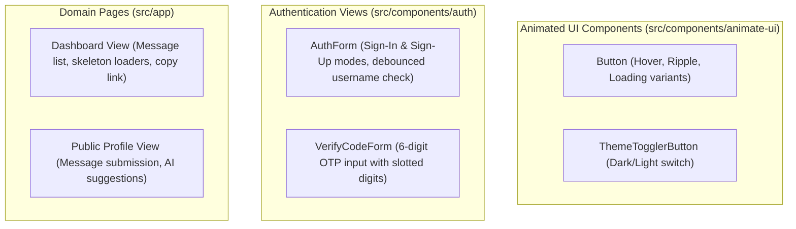

# Chapter 10: Storybook & UI Component Catalog

This chapter details component isolation, mock testing environments, theme previews, and visual component documentation.

---

## 1. Component Isolation Philosophy

In modern full-stack Next.js applications, UI components must be isolated from backend network side-effects. GhostMsg achieves component independence through provider wrapping and mock state fixtures.

### Provider Matrix
Components in isolation require the three core context providers:
1. **[`AuthProvider`](file:///d:/Projects/GhostMsg/src/context/auth-provider.tsx)**: Provides session states (`authenticated`, `loading`, `unauthenticated`).
2. **[`QueryProvider`](file:///d:/Projects/GhostMsg/src/context/query-provider.tsx)**: Provides TanStack React Query cache with custom test query clients.
3. **[`ThemeProvider`](file:///d:/Projects/GhostMsg/src/context/theme-provider.tsx)**: Provides light/dark theme CSS variables and toggles.

---

## 2. Key Component Catalog & States

---

## 3. Mock State & Fixture Integration

When developing or visually testing components, use the predefined mock payloads in [`src/mock/`](file:///d:/Projects/GhostMsg/src/mock) to simulate:
- Empty inbox state.
- Loaded inbox with chronologically ordered messages.
- Username availability check (available vs taken states).
- Network loading spinners and toast notifications.

---

## 4. Documentation Index
Return to the [Documentation Table of Contents](file:///d:/Projects/GhostMsg/docs/README.md).
