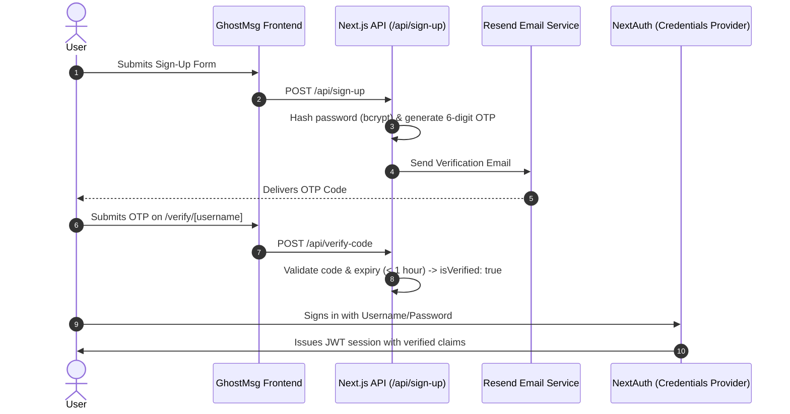

# ADR 0002: Dual Authentication Strategy and Email Verification

## Status
**Accepted** *(Email transport updated from Resend to Nodemailer SMTP via [ADR 0011](file:///d:/Projects/GhostMsg/docs/adr/0011-openapi-sdk-smtp-mailer-and-sender-unblocking.md))*

---

## Context & Problem Statement
GhostMsg requires user identity management so creators can manage their public link, toggle message acceptance, and review their private inbox.

Allowing unverified credential sign-ups invites spam accounts, bot manipulation, and unrecoverable user credentials. However, requiring complex multi-step email verification for every login adds unnecessary friction. We needed an authentication architecture that balances spam prevention with a smooth user experience.

---

## Decision Drivers
1. **Spam & Abuse Resistance**: Prevent automated creation of dummy accounts by requiring proof of email ownership.
2. **Frictionless Social Onboarding**: Provide a 1-click login path for users who prefer third-party OAuth providers.
3. **Session Security & Edge Compatibility**: Use lightweight JSON Web Tokens (JWT) compatible with Next.js Edge Middleware for route protection.
4. **Reliable Transactional Emails**: Deliver verification codes quickly with low bounce rates using React Email templates and Resend.

---

## Considered Options

### Option A: Credentials-Only with Magic Links
- **Pros**: Passwordless, secure.
- **Cons**: Every login requires waiting for an email; email delivery delays degrade the sign-in experience.

### Option B: Google OAuth Only
- **Pros**: Zero password management; verified emails guaranteed by Google.
- **Cons**: Excludes privacy-conscious users who do not use Google services or prefer pseudo-anonymous email aliases.

### Option C: Dual Strategy (Credentials + Google OAuth) with Mandatory OTP (Chosen)
- **Pros**:
  - **Credentials Sign-Up**: Requires username, email, and password (hashed with `bcryptjs`, 10 rounds). Generates a time-bound (1-hour) 6-digit numeric verification code sent via Resend. The user is marked `isVerified: false` until the code is verified at `/verify/[username]`.
  - **Google OAuth**: Users signing in via Google are automatically provisioned and marked `isVerified: true` immediately.
  - **Enriched JWT Session**: NextAuth session token is populated with `_id`, `username`, `isVerified`, and `isAcceptingMessage` for zero-query permission checks.
- **Cons**: Requires custom verification code generation, expiration handling, and dedicated verification screens.

---

## The Decision
We chose **Option C**: NextAuth.js v4 configured with both Credentials and Google OAuth providers, backed by a 6-digit OTP email verification flow powered by Resend and React Email.

---

## Consequences

### Positive
- **Guaranteed Email Ownership**: Credential accounts cannot access the inbox or accept messages without email verification.
- **Fast Edge Route Protection**: Middleware checks JWT payload (`token.isVerified`) at the edge without database queries.
- **Modern Transactional Emails**: Beautiful HTML emails generated using `@react-email/components`.

### Negative & Mitigations
- **Unverified Account Accumulation**: Users who sign up but never verify could occupy usernames. Mitigated by allowing re-signup with updated credentials for existing unverified emails in [`src/app/api/sign-up/route.ts`](file:///d:/Projects/GhostMsg/src/app/api/sign-up/route.ts).

---

## References & Code Pointers
- NextAuth Configuration: [`src/app/api/auth/[...nextauth]/options.ts`](file:///d:/Projects/GhostMsg/src/app/api/auth/%5B...nextauth%5D/options.ts)
- Sign-Up Handler: [`src/app/api/sign-up/route.ts`](file:///d:/Projects/GhostMsg/src/app/api/sign-up/route.ts)
- Code Verification Handler: [`src/app/api/verify-code/route.ts`](file:///d:/Projects/GhostMsg/src/app/api/verify-code/route.ts)
- Verification Email Template: [`emails/verification-email.tsx`](file:///d:/Projects/GhostMsg/emails/verification-email.tsx)
- Route Protection Middleware: [`src/middleware.ts`](file:///d:/Projects/GhostMsg/src/middleware.ts)
