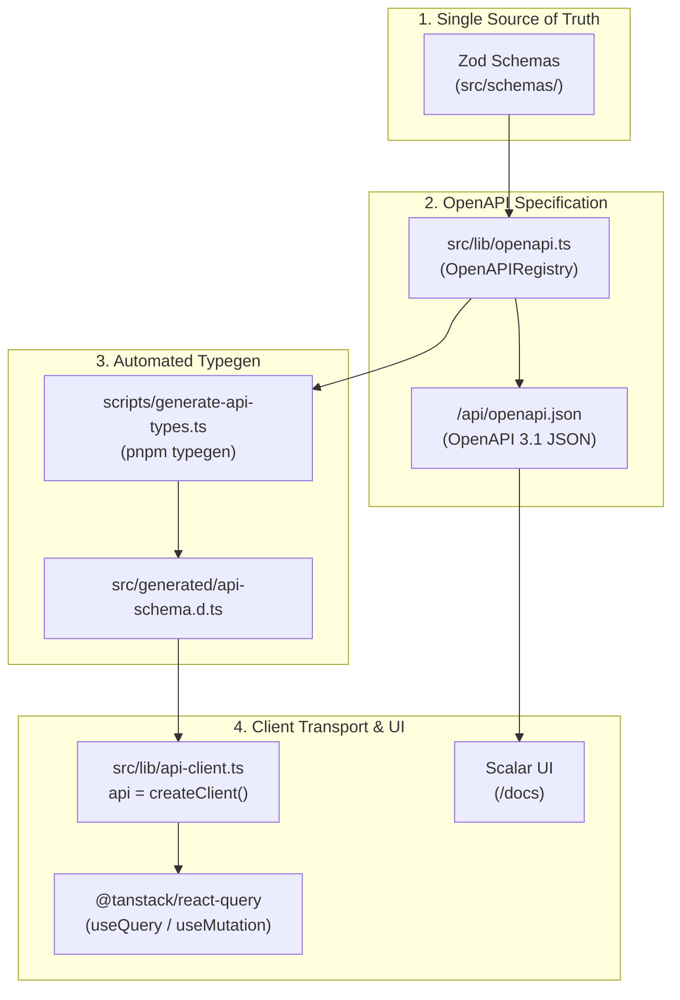

# ADR 0005: Type-Safe API Layer with Zod OpenAPI, openapi-fetch, Scalar, and React Query

## Status
**Accepted**

---

## Context & Problem Statement
GhostMsg previously relied on Axios for client-side API requests with manually authored TypeScript response interfaces maintained in `src/types/api-schema.ts`.

This architecture introduced several critical challenges:
1. **Contract Drift**: Any change to backend Route Handlers or Zod validators required manual updates to frontend interfaces. Missing or mismatched fields caused runtime errors that TypeScript could not catch at compile time.
2. **Axios Overhead & Boilerplate**: Axios added ~30kB to client bundles, required custom instance configuration, and used legacy non-standard cancel tokens instead of modern `AbortSignal`.
3. **No Interactive API Documentation**: Developers and third-party consumers had no interactive documentation or sandbox to test API endpoints against live or development instances.
4. **Ad-Hoc State Management**: Imperative data fetching lacked automated background cache invalidation, leading to stale UI states following mutations.

---

## Decision Drivers
1. **Single Source of Truth (SSoT)**: All API parameters, request bodies, and status-coded response schemas must derive from the existing Zod validation schemas in `src/schemas/`.
2. **End-to-End Type Safety**: Client HTTP requests must be strictly type-checked at compile time against backend contracts.
3. **Zero-Boilerplate Client SDK**: Lightweight, modern transport (<5kB) using standard `fetch` and native `AbortSignal`.
4. **Interactive Living Documentation**: Interactive API documentation generated dynamically from code without maintaining separate OpenAPI YAML files.
5. **Declarative Cache Synchronization**: Automatic cache invalidation and query deduplication with TanStack React Query.

---

## Considered Options

### Option A: tRPC
- **Pros**: Outstanding end-to-end type safety in pure TypeScript Next.js applications.
- **Cons**: Requires restructuring API route handlers into tRPC routers; does not produce standard REST endpoints or OpenAPI 3.1 specifications; locks the API into TypeScript-only consumers.

### Option B: Manual OpenAPI Specification (Swagger YAML) + Axios Code Generator
- **Pros**: Generates standard OpenAPI documentation.
- **Cons**: High manual maintenance burden; YAML specifications inevitably drift from runtime Zod validation logic.

### Option C: Zod OpenAPI + openapi-typescript + openapi-fetch + Scalar UI (Chosen)
- **Pros**:
  - **Zod as Single Source of Truth**: `@asteasolutions/zod-to-openapi` extends runtime validation schemas to generate OpenAPI 3.1 specifications in [`src/lib/openapi.ts`](file:///d:/Projects/GhostMsg/src/lib/openapi.ts).
  - **Automated Type Generation**: `openapi-typescript` compiles the specification into [`src/generated/api-schema.d.ts`](file:///d:/Projects/GhostMsg/src/generated/api-schema.d.ts) via `pnpm typegen`.
  - **Lightweight SDK**: `openapi-fetch` provides a 5-line, <5kB type-safe client with native `AbortSignal` and TypeScript path autocompletion.
  - **Interactive Documentation**: Scalar (`@scalar/nextjs-api-reference`) serves modern, interactive documentation at `/docs`.
  - **React Query Integration**: Seamlessly connects with `@tanstack/react-query` for query caching, loading states, and mutation invalidation.
- **Cons**: Requires running `pnpm typegen` when schemas change (automated in `pnpm build` and pre-commit checks).

---

## The Decision
We chose **Option C**: Adopt `@asteasolutions/zod-to-openapi` to generate OpenAPI 3.1 specs, `openapi-typescript` for automated type generation, `openapi-fetch` as the typed HTTP client, `@tanstack/react-query` for client data lifecycle, and Scalar for interactive documentation at `/docs`.

---

## Consequences

### Positive
- **Guaranteed Type Safety**: TypeScript verifies endpoint paths, query parameters, request bodies, and response types at compile time.
- **Axios Deprecated & Removed**: Bundle size decreased; native `AbortSignal` cancellation enabled out-of-the-box.
- **Interactive Documentation**: Scalar UI provides an interactive API sandbox at `/docs` with multi-language code snippets.
- **Zero Schema Drift**: `pnpm build` automatically triggers `pnpm typegen` to guarantee synchronized client types in CI/CD.

### Negative & Mitigations
- **Generated File Policy**: `src/generated/api-schema.d.ts` is auto-generated and must not be edited manually. Enforced via repository rules in [`AGENTS.md`](file:///d:/Projects/GhostMsg/AGENTS.md).

---

## References & Code Pointers
- OpenAPI Registry: [`src/lib/openapi.ts`](file:///d:/Projects/GhostMsg/src/lib/openapi.ts)
- Typegen Script: [`scripts/generate-api-types.ts`](file:///d:/Projects/GhostMsg/scripts/generate-api-types.ts)
- Client SDK: [`src/lib/api-client.ts`](file:///d:/Projects/GhostMsg/src/lib/api-client.ts)
- Scalar Docs Route: [`src/app/docs/route.ts`](file:///d:/Projects/GhostMsg/src/app/docs/route.ts)
- React Query Provider: [`src/context/query-provider.tsx`](file:///d:/Projects/GhostMsg/src/context/query-provider.tsx)
- Agent API Guidelines: [`docs/agents/api-patterns.md`](file:///d:/Projects/GhostMsg/docs/agents/api-patterns.md)
