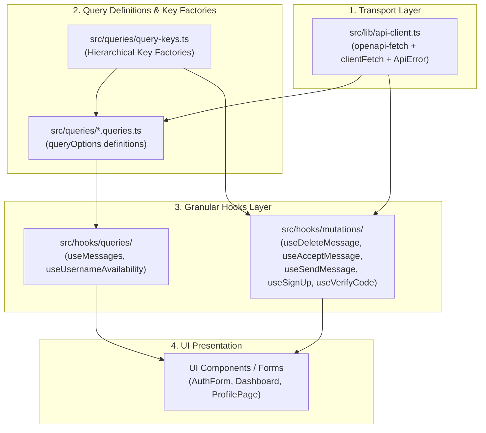

# ADR 0006: Standardized API Client and React Query Architecture

## Status
**Accepted**

---

## Context & Problem Statement

Following the adoption of OpenAPI 3.1 and `openapi-fetch` in [ADR 0005](file:///d:/Projects/GhostMsg/docs/adr/0005-type-safe-api-and-scalar-documentation.md), the client-side data consumption layer experienced architectural fragmentation:

1. **Inconsistent Transport Invocations**: Several components (e.g. [`VerifyCodeForm`](file:///d:/Projects/GhostMsg/src/components/auth/verify-code-form.tsx), [`AuthForm`](file:///d:/Projects/GhostMsg/src/components/auth/auth-form.tsx), and [`SendMessagePage`](file:///d:/Projects/GhostMsg/src/app/u/[username]/page.tsx)) directly invoked `api.POST` or `api.GET` inside `onSubmit` handlers and `useEffect` hooks, bypassing React Query entirely.
2. **Boilerplate Error & Data Unpacking**: Every query function and mutation handler repeated identical manual response checks (`const { data, error } = await api.GET(...); if (error || !data) throw new Error(...)`).
3. **Fragile Query Key Management**: Query keys were defined as ad-hoc, inline string arrays (`["messages"]`, `["accept-message"]`), lacking centralization, type safety, or structured hierarchy for scoped invalidations.
4. **Unoptimized Rerender Profiles**: Consolidating queries, session data, and mutation callbacks into monolithic hook returns (e.g. in [`useDashboard`](file:///d:/Projects/GhostMsg/src/hooks/use-dashboard.tsx)) triggered redundant component re-renders whenever unrelated states (such as background refetch flags) fluctuated.
5. **Divergent Optimistic UI Implementations**: Optimistic updates varied between React 19 `useOptimistic` + `useTransition` and un-optimistic mutation refetches, causing inconsistent user experience and mutation rollback vulnerabilities.

---

## Decision Drivers

1. **Universal Query & Mutation Encapsulation**: All client-side API requests must be orchestrated exclusively through React Query primitives (`useQuery`, `useMutation`), eliminating direct `api.*` invocations in UI components.
2. **Zero Boilerplate Transport**: A typed client unwrapper must automatically return typed response payloads and throw structured `ApiError` instances on HTTP or validation failures.
3. **Structured Query Key Factories & `queryOptions`**: Centralize query definitions with TanStack Query v5 `queryOptions()` and hierarchical key factories for seamless sharing across hooks, invalidations, and prefetching.
4. **Deterministic Optimistic UI**: Standardize optimistic updates using TanStack Query's `onMutate` -> `onError` (rollback) -> `onSettled` (revalidation) lifecycle for instant user feedback and resilient cache integrity.
5. **High-Performance Rerender Mitigation**: Decouple monolithic hook returns into granular domain primitives and leverage query `select` projections so components only re-render when subscribed data changes.

---

## Considered Options

### Option A: Direct API Client in UI Forms + React Query solely for Dashboard Data
- **Pros**: Minimal abstraction layer for simple form submits.
- **Cons**: Fragmented developer experience, duplicate loading/error state management (`useState` vs React Query), zero DevTools visibility for form submissions, race conditions during debounced username checks.

### Option B: React 19 Actions / Server Actions for all Writes
- **Pros**: Next.js native primitives.
- **Cons**: Bypasses the OpenAPI 3.1 / Scalar contract ecosystem; diverges from the client-side REST architecture and NextAuth session lifecycle.

### Option C: Unified TanStack Query v5 Architecture with Query Key Factories, Typed Client Unwrapper, and Cache Optimism (Chosen)
- **Pros**:
  - **Single Source of Truth**: Query keys and query options centralized in `src/queries/` using `queryOptions`.
  - **Typed `clientFetch` Helper**: Single point of failure for response unwrapping and typed `ApiError` throwing.
  - **Deterministic Cache Optimism**: Standardized `onMutate` cache snapshots provide instantaneous UI responses with automatic rollback on network failure.
  - **Granular Rendering**: `select` projections and atomic mutation hooks eliminate wasted re-renders.
  - **DevTools Transparency**: All network interactions and cache states are fully inspectable via TanStack Query DevTools.
- **Cons**: Requires standardizing existing legacy forms to use custom mutation hooks.

---

## The Decision

We chose **Option C**. We establish a unified 4-layer client architecture:

### Architecture Specifications

1. **Typed Transport Unwrapper (`clientFetch`)**:
   `src/lib/api-client.ts` exposes a typed helper that unpacks `data` and throws `ApiError` with HTTP status code and server messages when `error` is present.
2. **Query Key Factories & `queryOptions`**:
   Pure, hook-free query options defined via `queryOptions()` in `src/queries/`.
3. **Standardized Optimistic Mutations**:
   All stateful mutations ([`Message Acceptance`](file:///d:/Projects/GhostMsg/GLOSSARY.md#L19-L22), [`Anonymous Message`](file:///d:/Projects/GhostMsg/GLOSSARY.md#L7-L10) deletion) utilize `onMutate` cache updates with context-driven rollback in `onError`.
4. **Component Segregation & Render Boundary Isolation**:
   Components mixing multiple async operations (e.g. `SendMessagePage`, `AuthForm`, `Dashboard`) are decomposed into focused subcomponents (`SendMessageForm`, `SuggestedMessagesSection`, `UsernameField`, `MessageCard`) to isolate re-renders and local state.
5. **Form Integration**:
   Forms utilize `useMutation` hooks (`useSignUpMutation`, `useVerifyCodeMutation`, `useSendMessageMutation`) and bind directly to `mutation.isPending` and `mutation.mutate()`.
6. **QueryClient Global Configuration**:
   Configured with `staleTime: 60s`, `gcTime: 5m`, `refetchOnWindowFocus: false`, and retry functions that immediately abort retries on HTTP 4xx client errors.

---

## Consequences

### Positive
- **Complete Elimination of Ad-Hoc Calls**: Every API interaction is managed consistently by React Query.
- **Isolated Render Boundaries**: Heavy re-renders from debounced keystrokes or AI suggestions are strictly contained within their respective subcomponents.
- **Instantaneous UI Responsiveness**: Message deletion and acceptance toggling reflect instantly in the UI with zero perceived latency.
- **Reduced Component Re-renders**: Granular hook separation, component decomposition, and `select` transformations prevent re-render cascading across dashboard cards.
- **Robust Error Handling**: Structured `ApiError` instances ensure uniform error toast delivery and form field error mapping.
- **Cache Invalidation Precision**: Key factories guarantee scoped cache invalidation without accidentally wiping unrelated query states.

### Negative & Mitigations
- **Additional Layer of Hook Files**: Requires maintaining dedicated query/mutation hook files under `src/queries/` and `src/hooks/mutations/`.
  - *Mitigation*: Standardized template patterns and scaffolding guidelines in `docs/agents/api-patterns.md`.

---

## References & Code Pointers
- Architecture Blueprint: [`docs/api-and-react-query-architecture.md`](file:///d:/Projects/GhostMsg/docs/api-and-react-query-architecture.md)
- Agent API Guidelines: [`docs/agents/api-patterns.md`](file:///d:/Projects/GhostMsg/docs/agents/api-patterns.md)
- API Type Safety ADR: [`docs/adr/0005-type-safe-api-and-scalar-documentation.md`](file:///d:/Projects/GhostMsg/docs/adr/0005-type-safe-api-and-scalar-documentation.md)
- Domain Glossary: [`GLOSSARY.md`](file:///d:/Projects/GhostMsg/GLOSSARY.md)
