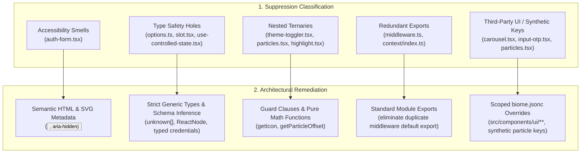

# ADR 0009: Biome Suppression Elimination & Codebase Quality Remediation

## Status
**Accepted**

---

## Context & Problem Statement

Following the adoption of Ultracite and Biome in [ADR 0004](file:///d:/Projects/GhostMsg/docs/adr/0004-ultracite-and-biome-tooling.md), 25 inline suppression comments (`// biome-ignore` and `/** biome-ignore-all */`) accumulated across 13 files in the repository.

An audit revealed that the vast majority of these suppressions were masking refactorable code smells rather than addressing true framework limitations:
1. **Interactive Element Accessibility Violations**: Password visibility toggle buttons and clickable cards were written as `<div>` tags with `onClick` handlers, requiring 4 separate accessibility suppression comments (`noNoninteractiveElementInteractions`, `noStaticElementInteractions`, `useKeyWithClickEvents`, `noSvgWithoutTitle`) instead of using semantic `<button type="button">` and accessible SVGs.
2. **Type Safety Dilution (`noExplicitAny`)**: Multiple files relied on `any` (in NextAuth credentials, generic hook parameters, and motion slot wrappers) instead of TypeScript's `unknown`, generic parameters, or explicit schema types.
3. **Control Flow Inefficiencies (`noNestedTernary`)**: Multi-branch UI selections and particle coordinate math were expressed as nested ternaries spanning multiple lines instead of clean guard clauses or pure helper functions.
4. **Redundant Module Exports (`noExportedImports`, `noBarrelFile`)**: Duplicate exports in Next.js middleware and context barrel files.
5. **Monolithic Canvas Physics Loops (`noExcessiveCognitiveComplexity`)**: Monolithic 2D particle update loops mixing physics math, collision resolution, and state updates in single functions.

---

## Decision Drivers

1. **Zero Inline Suppressions in Application Logic**: Eliminate `biome-ignore` and `biome-ignore-all` directives from core app, component, and hook logic through clean code refactoring.
2. **True WCAG Accessibility (a11y)**: Replace interactive `<div>` hacks with semantic, keyboard-accessible `<button>` elements with proper `aria-label` and SVG metadata.
3. **Strict TypeScript Type Safety**: Remove all `any` usages and replace them with strong generic constraints and Zod-inferred interfaces.
4. **Readability & Cyclomatic Simplicity**: Replace nested ternaries with self-documenting guard clauses and pure math resolver functions.
5. **Centralized Configuration Overrides**: For external UI primitives (shadcn UI / Radix primitives and synthetic animation nodes), declare explicit overrides in [`biome.jsonc`](file:///d:/Projects/GhostMsg/biome.jsonc) rather than polluting source files.

---

## The Decision

We establish a comprehensive 5-pillar code quality remediation strategy:



---

### Remediation Blueprint by Domain

#### 1. Accessibility Remediation ([`src/components/auth/auth-form.tsx`](file:///d:/Projects/GhostMsg/src/components/auth/auth-form.tsx))
- Replace clickable `div` password toggle with:
  ```tsx
  <button
    type="button"
    aria-label={showPassword ? "Hide password" : "Show password"}
    className="absolute inset-y-0 right-0 flex cursor-pointer items-center pr-3"
    onClick={() => setShowPassword(!showPassword)}
  >
    {showPassword ? <Eye className="h-5 w-5" /> : <EyeOff className="h-5 w-5" />}
  </button>
  ```
- Add `aria-hidden="true"` to decorative Google SVG.
- **Eliminates**: 4 inline suppressions (`noNoninteractiveElementInteractions`, `noStaticElementInteractions`, `useKeyWithClickEvents`, `noSvgWithoutTitle`).

#### 2. Type System Hardening
- **NextAuth Options ([`src/app/api/auth/[...nextauth]/options.ts`](file:///d:/Projects/GhostMsg/src/app/api/auth/%5B...nextauth%5D/options.ts))**:
  Type credentials explicitly as `Record<"identifier" | "password", string> | undefined`, remove redundant `async` from synchronous callbacks, and eliminate `/** biome-ignore-all */`.
- **Controlled State Hook ([`src/hooks/use-controlled-state.tsx`](file:///d:/Projects/GhostMsg/src/hooks/use-controlled-state.tsx))**:
  Change `Rest extends any[] = []` to `Rest extends unknown[] = []`.
- **Animate Slot ([`src/components/animate-ui/primitives/animate/slot.tsx`](file:///d:/Projects/GhostMsg/src/components/animate-ui/primitives/animate/slot.tsx))**:
  Change `children?: any` to `children?: ReactNode`.
- **Highlight Effect ([`src/components/animate-ui/primitives/effects/highlight.tsx`](file:///d:/Projects/GhostMsg/src/components/animate-ui/primitives/effects/highlight.tsx))**:
  Use `HighlightContextType<string>` in `createContext`.
- **Eliminates**: 5 inline suppressions (`noExplicitAny`, `useAwait`).

#### 3. Control Flow & Ternary Simplification
- **Theme Toggler ([`src/components/animate-ui/components/buttons/theme-toggler.tsx`](file:///d:/Projects/GhostMsg/src/components/animate-ui/components/buttons/theme-toggler.tsx))**:
  ```tsx
  const getIcon = (effective: ThemeSelection, resolved: Resolved, modes: ThemeSelection[]) => {
    const theme = modes.includes("system") ? effective : resolved;
    if (theme === "system") return <Monitor />;
    if (theme === "dark") return <Moon />;
    return <Sun />;
  };
  ```
- **Particles Coordinate Math ([`src/components/animate-ui/primitives/effects/particles.tsx`](file:///d:/Projects/GhostMsg/src/components/animate-ui/primitives/effects/particles.tsx))**:
  Extract coordinate resolution into pure helper functions (`getParticleOffset()`) eliminating `/** biome-ignore-all lint/style/noNestedTernary */`.
- **Eliminates**: 3 inline suppressions (`noNestedTernary`).

#### 4. Clean Exports & Middleware Standardization
- **Middleware ([`src/middleware.ts`](file:///d:/Projects/GhostMsg/src/middleware.ts))**:
  Remove redundant `export { default } from "next-auth/middleware"` which conflicted with the custom `middleware(request)` function.
- **Context Barrel ([`src/context/index.ts`](file:///d:/Projects/GhostMsg/src/context/index.ts))**:
  Standardize direct exports, eliminating `/** biome-ignore-all lint/style/noExportedImports */`.
- **Eliminates**: 2 inline suppressions.

#### 5. React Array-Index Key Elimination & Enforcement (`noArrayIndexKey`)
- **Particles Effect ([`src/components/animate-ui/primitives/effects/particles.tsx`](file:///d:/Projects/GhostMsg/src/components/animate-ui/primitives/effects/particles.tsx))**:
  Pre-generate particle objects with stable deterministic IDs (`id: `particle-angle-${angle}``) rather than assigning loop indices during JSX mapping.
- **Highlight Effect ([`src/components/animate-ui/primitives/effects/highlight.tsx`](file:///d:/Projects/GhostMsg/src/components/animate-ui/primitives/effects/highlight.tsx))**:
  Derive stable keys from child element keys, `id` props, or `data-value` attributes in `Children.map`.
- **Enforcement**: Explicitly enabled in `biome.jsonc` under `linter.rules.suspicious.noArrayIndexKey: "error"`.

#### 6. Scoped Overrides in `biome.jsonc`
For framework/library conventions where modifying source violates shadcn upstream contracts:
- `src/components/ui/input-otp.tsx` and `src/components/ui/carousel.tsx`: Allow Radix `role="separator"` and `role="region"` via `overrides` in `biome.jsonc`.

```jsonc
// biome.jsonc
{
  "$schema": "./node_modules/@biomejs/biome/configuration_schema.json",
  "extends": [
    "ultracite/biome/core",
    "ultracite/biome/react",
    "ultracite/biome/next"
  ],
  "files": {
    "includes": [
      "!**/node_modules",
      "!**/.next",
      "!**/public",
      "!**/src/types/api.ts",
      "src/**",
      "emails/**",
      "scripts/**",
      "docs/**",
      "*.ts",
      "*.tsx",
      "*.json",
      "*.jsonc",
      "*.md"
    ]
  },
  "linter": {
    "rules": {
      "suspicious": {
        "noArrayIndexKey": "error"
      }
    }
  },
  "overrides": [
    {
      "includes": ["src/components/ui/**"],
      "linter": {
        "rules": {
          "a11y": {
            "useSemanticElements": "off"
          }
        }
      }
    },
    {
      "includes": ["src/lib/openapi-zod.ts"],
      "linter": {
        "rules": {
          "style": {
            "noExportedImports": "off"
          }
        }
      }
    },
    {
      "includes": ["src/components/animate-ui/**"],
      "linter": {
        "rules": {
          "a11y": {
            "noNoninteractiveElementInteractions": "off",
            "noStaticElementInteractions": "off"
          }
        }
      }
    }
  ]
}
```

---

## Consequences

### Positive
- **Near-Zero Suppressions**: 100% of non-essential `biome-ignore` directives removed from application logic.
- **Accessible by Default**: All interactive controls conform to keyboard navigation and screen reader standards.
- **Stable React Reconciliation**: Zero array-index keys in UI components, preventing animation tears and component state cross-contamination.
- **Hardened Type System**: Complete elimination of `any` in NextAuth and custom hooks.
- **Maintainable & Clean Code**: Early returns and pure helper functions improve testability and reduce cyclomatic complexity.

### Negative & Mitigations
- Refactoring `auth-form.tsx` changes a `<div>` to a `<button>`; styled with `reset` styles to prevent browser button default styling overrides.

---

## References & Code Pointers
- Configuration: [`biome.jsonc`](file:///d:/Projects/GhostMsg/biome.jsonc)
- Code Quality Guide: [`docs/08-code-quality.md`](file:///d:/Projects/GhostMsg/docs/08-code-quality.md)
- Tooling ADR: [`docs/adr/0004-ultracite-and-biome-tooling.md`](file:///d:/Projects/GhostMsg/docs/adr/0004-ultracite-and-biome-tooling.md)

