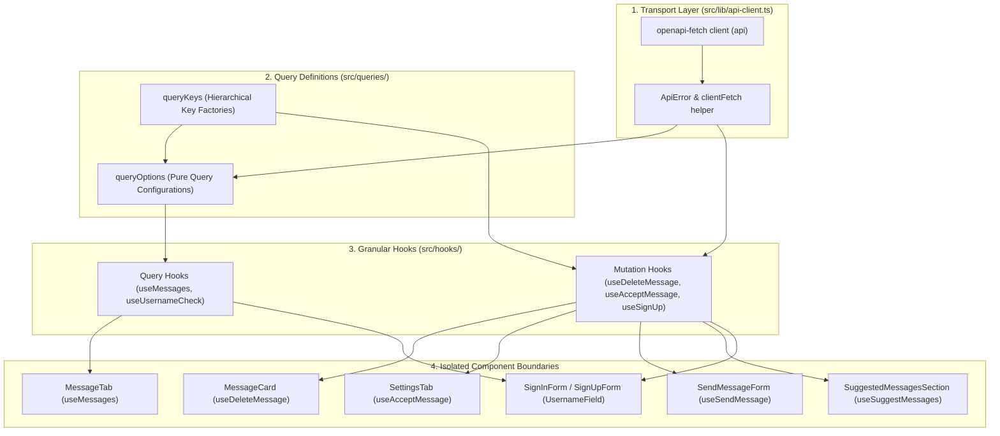
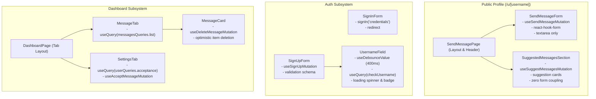

# API Calling & React Query Architecture Blueprint

This document specifies the standard architecture, patterns, performance optimizations, component segregation, and optimistic UI implementation guidelines for API consumption across GhostMsg.

---

## 1. Architecture Overview & Design Principles

GhostMsg standardizes on a **4-layer client architecture** connecting OpenAPI 3.1 contracts directly to high-performance React UI components:



### Core Principles
1. **Zero Direct `api.*` in UI**: All API operations are consumed via React Query hooks (`useQuery`, `useMutation`).
2. **Throwing Transport Unwrapper**: Transport calls unpack `data` and throw typed `ApiError` instances so React Query error handling is seamless and consistent.
3. **Pure Query Options (`queryOptions`)**: Query definitions are pure objects decoupled from React hooks, enabling reuse across client hooks, prefetching, and cache invalidators.
4. **Deterministic Cache-Level Optimism**: Stateful interactions ([`Message Acceptance`](file:///d:/Projects/GhostMsg/GLOSSARY.md#L19-L22), [`Anonymous Message`](file:///d:/Projects/GhostMsg/GLOSSARY.md#L7-L10) deletion) execute optimistic cache transformations with automated rollback on failure.
5. **Component Segregation & Render Boundary Isolation**: Heavy pages and multi-state forms are split into focused single-responsibility components so state changes (e.g. typing or spinners) never re-render unrelated siblings.

---

## 2. Layer 1: Transport & Error Unwrapping (`src/lib/api-client.ts`)

### `ApiError` Class
A structured error class capturing HTTP status code, server error message, and validation details:

```typescript
export class ApiError extends Error {
  public readonly status: number;
  public readonly details?: unknown;

  constructor(message: string, status = 500, details?: unknown) {
    super(message);
    this.name = "ApiError";
    this.status = status;
    this.details = details;
  }
}
```

### Typed Client Wrapper (`clientFetch`)
Standardized response unwrapper that eliminates boilerplate `if (error || !data)` across the codebase:

```typescript
import createClient from "openapi-fetch";
import type { paths } from "@/generated/api-schema";

export const api = createClient<paths>({
  baseUrl: "",
});

export type ApiPaths = paths;

/**
 * Type-safe wrapper around openapi-fetch operations that returns data directly
 * and throws structured ApiError on non-2xx responses.
 */
export async function clientFetch<TData>(
  requestPromise: Promise<{ data?: TData; error?: { message?: string; [key: string]: unknown }; response: Response }>
): Promise<TData> {
  const { data, error, response } = await requestPromise;

  if (error || !data) {
    const message = error?.message || `HTTP ${response.status}: Request failed`;
    throw new ApiError(message, response.status, error);
  }

  return data;
}
```

---

## 3. Layer 2: Query Key Factories & `queryOptions` (`src/queries/`)

### Hierarchical Query Key Factory (`src/queries/query-keys.ts`)

Centralizing all query keys prevents typos and enables fine-grained or broad cache invalidations:

```typescript
export const queryKeys = {
  messages: {
    all: ["messages"] as const,
    list: () => [...queryKeys.messages.all, "list"] as const,
    detail: (id: string) => [...queryKeys.messages.all, "detail", id] as const,
  },
  user: {
    all: ["user"] as const,
    acceptance: () => [...queryKeys.user.all, "acceptance"] as const,
  },
  auth: {
    all: ["auth"] as const,
    checkUsername: (username: string) => [...queryKeys.auth.all, "check-username", username] as const,
  },
} as const;
```

### Domain Query Options (`src/queries/messages.queries.ts`)

Query options define the fetch contract independently from React component lifecycle:

```typescript
import { queryOptions } from "@tanstack/react-query";
import { api, clientFetch } from "@/lib/api-client";
import { queryKeys } from "./query-keys";

export const messagesQueries = {
  list: () =>
    queryOptions({
      queryKey: queryKeys.messages.list(),
      queryFn: ({ signal }) =>
        clientFetch(api.GET("/api/get-messages", { signal })),
      staleTime: 30 * 1000, // 30 seconds
    }),
};
```

### User & Settings Query Options (`src/queries/user.queries.ts`)

```typescript
import { queryOptions } from "@tanstack/react-query";
import { api, clientFetch } from "@/lib/api-client";
import { queryKeys } from "./query-keys";

export const userQueries = {
  acceptance: () =>
    queryOptions({
      queryKey: queryKeys.user.acceptance(),
      queryFn: ({ signal }) =>
        clientFetch(api.GET("/api/accept-message", { signal })),
      staleTime: 60 * 1000, // 1 minute
    }),
};
```

### Auth & Validation Query Options (`src/queries/auth.queries.ts`)

```typescript
import { queryOptions } from "@tanstack/react-query";
import { api, clientFetch } from "@/lib/api-client";
import { queryKeys } from "./query-keys";

export const authQueries = {
  checkUsername: (username: string) =>
    queryOptions({
      queryKey: queryKeys.auth.checkUsername(username),
      queryFn: ({ signal }) =>
        clientFetch(
          api.GET("/api/check-username-unique", {
            params: { query: { username } },
            signal,
          })
        ),
      enabled: Boolean(username && username.length >= 2),
      staleTime: 60 * 1000,
      gcTime: 5 * 60 * 1000,
    }),
};
```

---

## 4. Layer 3: Optimistic Mutations & Granular Hooks (`src/hooks/`)

### Optimistic Message Acceptance Toggle (`src/hooks/mutations/use-accept-message-mutation.ts`)

Replaces React 19 `useOptimistic` + `useTransition` with TanStack Query cache-level optimistic updates:

```typescript
import { useMutation, useQueryClient } from "@tanstack/react-query";
import { toast } from "sonner";
import { api, clientFetch } from "@/lib/api-client";
import { queryKeys } from "@/queries/query-keys";

export function useAcceptMessageMutation() {
  const queryClient = useQueryClient();

  return useMutation({
    mutationFn: (acceptMessages: boolean) =>
      clientFetch(
        api.POST("/api/accept-message", {
          body: { acceptMessages },
        })
      ),

    // 1. Optimistic Update Phase
    onMutate: async (newStatus: boolean) => {
      await queryClient.cancelQueries({ queryKey: queryKeys.user.acceptance() });
      const previousState = queryClient.getQueryData<{ isAcceptingMessage: boolean }>(
        queryKeys.user.acceptance()
      );

      queryClient.setQueryData(queryKeys.user.acceptance(), {
        isAcceptingMessage: newStatus,
        success: true,
      });

      return { previousState };
    },

    // 2. Rollback on Error
    onError: (error, _newStatus, context) => {
      if (context?.previousState) {
        queryClient.setQueryData(queryKeys.user.acceptance(), context.previousState);
      }
      toast.error(error.message || "Failed to update acceptance status");
    },

    // 3. Reconcile with Server State
    onSuccess: (data) => {
      toast.success(data.message || "Message acceptance updated");
    },
    onSettled: () => {
      queryClient.invalidateQueries({ queryKey: queryKeys.user.acceptance() });
    },
  });
}
```

### Optimistic Message Deletion (`src/hooks/mutations/use-delete-message-mutation.ts`)

Instantly removes deleted messages from UI list and restores them if network fails:

```typescript
import { useMutation, useQueryClient } from "@tanstack/react-query";
import { toast } from "sonner";
import { api, clientFetch } from "@/lib/api-client";
import { queryKeys } from "@/queries/query-keys";
import type { Message } from "@/model/user.model";

interface MessagesResponse {
  messages: Message[];
  success: boolean;
}

export function useDeleteMessageMutation() {
  const queryClient = useQueryClient();

  return useMutation({
    mutationFn: (messageId: string) =>
      clientFetch(
        api.DELETE("/api/delete-message/{messageId}", {
          params: { path: { messageId } },
        })
      ),

    onMutate: async (messageId: string) => {
      await queryClient.cancelQueries({ queryKey: queryKeys.messages.list() });
      const previousData = queryClient.getQueryData<MessagesResponse>(queryKeys.messages.list());

      if (previousData) {
        queryClient.setQueryData<MessagesResponse>(queryKeys.messages.list(), {
          ...previousData,
          messages: previousData.messages.filter((msg) => String(msg._id) !== messageId),
        });
      }

      return { previousData };
    },

    onError: (error, _id, context) => {
      if (context?.previousData) {
        queryClient.setQueryData(queryKeys.messages.list(), context.previousData);
      }
      toast.error(error.message || "Failed to delete message");
    },

    onSuccess: (data) => {
      toast.success(data.message || "Message deleted successfully");
    },

    onSettled: () => {
      queryClient.invalidateQueries({ queryKey: queryKeys.messages.list() });
    },
  });
}
```

### Form Action Mutations (`useSignUpMutation`, `useVerifyCodeMutation`, `useSendMessageMutation`, `useSuggestMessagesMutation`)

```typescript
// use-sign-up-mutation.ts
export function useSignUpMutation() {
  return useMutation({
    mutationFn: (payload: { username: string; email: string; password: string }) =>
      clientFetch(api.POST("/api/sign-up", { body: payload })),
  });
}

// use-verify-code-mutation.ts
export function useVerifyCodeMutation() {
  return useMutation({
    mutationFn: (payload: { username: string; code: string }) =>
      clientFetch(api.POST("/api/verify-code", { body: payload })),
  });
}

// use-send-message-mutation.ts
export function useSendMessageMutation() {
  return useMutation({
    mutationFn: (payload: { username: string; content: string }) =>
      clientFetch(api.POST("/api/send-message", { body: payload })),
  });
}

// use-suggest-messages-mutation.ts
export function useSuggestMessagesMutation() {
  return useMutation({
    mutationFn: () => clientFetch(api.GET("/api/suggest-messages")),
  });
}
```

---

## 5. Layer 4: Component Segregation & Render Boundary Isolation

To maximize runtime performance, prevent UI jank, and stop state leaks between features, components mixing multiple asynchronous lifecycles are segregated into atomic, single-responsibility units:



### A. Public Profile Segregation (`src/app/u/[username]/`)

#### 1. `SendMessageForm` (`src/components/profile/send-message-form.tsx`)
Encapsulates message drafting and submission. Isolated from suggestion fetching so typing never re-renders the AI prompts.

```typescript
interface SendMessageFormProps {
  username: string;
  selectedContent?: string;
  onSubmitted?: () => void;
}

export function SendMessageForm({ username, selectedContent, onSubmitted }: SendMessageFormProps) {
  const form = useForm<MessageFormData>({
    resolver: zodResolver(messageSchema),
    defaultValues: { content: "" },
  });

  const sendMutation = useSendMessageMutation();

  useEffect(() => {
    if (selectedContent) {
      form.setValue("content", selectedContent, { shouldValidate: true });
    }
  }, [selectedContent, form]);

  const onSubmit = async (data: MessageFormData) => {
    try {
      const res = await sendMutation.mutateAsync({ username, content: data.content });
      toast.success(res.message);
      form.reset();
      onSubmitted?.();
    } catch (error) {
      const err = error as Error;
      toast.error(err.message || "Failed to send message");
    }
  };

  return (
    <Form {...form}>
      <form onSubmit={form.handleSubmit(onSubmit)} className="w-full max-w-2xl space-y-4">
        <FormField
          control={form.control}
          name="content"
          render={({ field }) => (
            <FormItem>
              <Label>Send your Anonymous Message to @{username}</Label>
              <FormControl>
                <Textarea placeholder="Type your message here..." {...field} />
              </FormControl>
              <FormMessage />
            </FormItem>
          )}
        />
        <Button disabled={!form.formState.isValid || sendMutation.isPending} type="submit">
          {sendMutation.isPending ? "Sending..." : "Send"}
        </Button>
      </form>
    </Form>
  );
}
```

#### 2. `SuggestedMessagesSection` (`src/components/profile/suggested-messages-section.tsx`)
Encapsulates on-demand AI prompt generation. Generation spin state is completely isolated from the form.

```typescript
interface SuggestedMessagesSectionProps {
  onSelectSuggestion: (message: string) => void;
}

export function SuggestedMessagesSection({ onSelectSuggestion }: SuggestedMessagesSectionProps) {
  const [messages, setMessages] = useState<string[]>([]);
  const suggestMutation = useSuggestMessagesMutation();

  const handleFetchSuggestions = async () => {
    try {
      const res = await suggestMutation.mutateAsync();
      const list = (res.messages || "").split("||").map((s) => s.trim()).filter(Boolean);
      setMessages(list);
    } catch (error) {
      const err = error as Error;
      toast.error(err.message || "Failed to generate suggestions");
    }
  };

  return (
    <div className="flex flex-col items-center gap-4">
      <Button disabled={suggestMutation.isPending} onClick={handleFetchSuggestions} size="lg">
        <RefreshCw className={cn("mr-2 h-4 w-4", suggestMutation.isPending && "animate-spin")} />
        Suggest Messages
      </Button>

      {messages.length > 0 && (
        <Card className="w-full max-w-2xl">
          <CardContent className="flex flex-col gap-3 p-4">
            {messages.map((prompt, idx) => (
              <Button
                key={`suggestion-${idx}-${prompt.slice(0, 15)}`}
                onClick={() => onSelectSuggestion(prompt)}
                variant="outline"
                className="justify-start text-left h-auto py-2 whitespace-normal"
              >
                {prompt}
              </Button>
            ))}
          </CardContent>
        </Card>
      )}
    </div>
  );
}
```

#### 3. Assembled `SendMessagePage` (`src/app/u/[username]/page.tsx`)
A lean container binding `SuggestedMessagesSection` selection into `SendMessageForm`.

---

### B. Auth Subsystem Segregation (`src/components/auth/`)

1. **`UsernameField` (`src/components/auth/username-field.tsx`)**:
   - Isolates `useDebounceValue(username, 400)` and `useQuery(authQueries.checkUsername)`.
   - Re-renders **only** the username field and status icon (spinner/check/cross) without re-rendering password or email inputs.
2. **`SignInForm` (`src/components/auth/sign-in-form.tsx`)**:
   - Clean credentials sign-in without mode-switching branches.
3. **`SignUpForm` (`src/components/auth/sign-up-form.tsx`)**:
   - Clean registration form using `useSignUpMutation()` and the isolated `UsernameField`.

---

### C. Dashboard Subsystem Segregation (`src/components/dashboard/`)

1. **`MessageTab` (`src/components/dashboard/message-tab.tsx`)**:
   - Subscribes directly to `useQuery(messagesQueries.list())`.
   - Owns the refresh trigger using `refetch()`.
2. **`MessageCard` (`src/components/dashboard/message-card.tsx`)**:
   - Subscribes directly to `useDeleteMessageMutation()`.
   - Eliminates prop drilling `onDelete` callbacks from parent layouts.
3. **`SettingsTab` (`src/components/dashboard/settings-tab.tsx`)**:
   - Subscribes to `useQuery(userQueries.acceptance())` and `useAcceptMessageMutation()`.
   - Changes here cause **zero re-renders** in `MessageTab` or message cards.

---

## 6. Performance & Rerender Mitigation Strategy

### Global QueryClient Configuration (`src/context/query-provider.tsx`)

```typescript
export function makeQueryClient(): QueryClient {
  return new QueryClient({
    defaultOptions: {
      queries: {
        staleTime: 60 * 1000,       // 1 minute default stale time
        gcTime: 5 * 60 * 1000,      // 5 minutes cache retention
        refetchOnWindowFocus: false, // Avoid window-focus flash
        retry: (failureCount, error) => {
          // Never retry on 4xx client errors (400, 401, 403, 404, 422)
          if (error instanceof ApiError && error.status >= 400 && error.status < 500) {
            return false;
          }
          return failureCount < 2;
        },
      },
    },
  });
}
```

### Domain Data Life Cycle & Cache Times

| Entity / Endpoint | Stale Time | GC Time | Invalidation Trigger | Optimistic UI |
| :--- | :--- | :--- | :--- | :--- |
| **Messages List** (`/api/get-messages`) | 30s | 5m | Message Deleted, Manual Refresh | Yes (`onMutate` delete) |
| **Acceptance Status** (`/api/accept-message`) | 60s | 5m | Status Toggled | Yes (`onMutate` toggle) |
| **Username Uniqueness** (`/api/check-username-unique`) | 60s | 5m | N/A (Read Cache) | N/A (Debounced query) |
| **Suggested Messages** (`/api/suggest-messages`) | 0s | 0s | On-Demand Generation | N/A (useMutation) |

### Preventing Unnecessary Component Rerenders

1. **Selective Subscriptions (`select`)**:
   Use `select` to transform data before it reaches the component. Component will ONLY re-render if the projected output changes:
   ```typescript
   export function useMessageCount() {
     return useQuery({
       ...messagesQueries.list(),
       select: (data) => data.messages?.length ?? 0,
     });
   }
   ```
2. **Stable Reconciliation Keys**:
   Never use `Math.random()` or array indexes as React keys (e.g. for Suggested Messages). Use deterministic content keys:
   ```typescript
   {suggestedMessages.map((m, idx) => (
     <Button key={`msg-suggestion-${idx}-${m.slice(0, 15)}`} ...>
       {m}
     </Button>
   ))}
   ```
3. **Render Boundary Segregation**:
   Keep async triggers (like AI generation and debounced validation) in their own component boundaries to prevent parent tree re-rendering.

---

## 7. Migration Checklist for Agents & Developers

- [ ] **Milestone 1: Transport Helper**
  - Update [`src/lib/api-client.ts`](file:///d:/Projects/GhostMsg/src/lib/api-client.ts) with `ApiError` and `clientFetch`.
- [ ] **Milestone 2: Query Keys & Pure Options**
  - Create `src/queries/query-keys.ts`.
  - Create `src/queries/messages.queries.ts`, `src/queries/user.queries.ts`, `src/queries/auth.queries.ts`.
- [ ] **Milestone 3: Mutation Hooks with Optimistic Rollback**
  - Create `src/hooks/mutations/use-delete-message-mutation.ts` (with `onMutate` list filtering).
  - Create `src/hooks/mutations/use-accept-message-mutation.ts` (with `onMutate` boolean toggle).
  - Create `src/hooks/mutations/use-send-message-mutation.ts`.
  - Create `src/hooks/mutations/use-sign-up-mutation.ts`.
  - Create `src/hooks/mutations/use-verify-code-mutation.ts`.
  - Create `src/hooks/mutations/use-suggest-messages-mutation.ts`.
- [ ] **Milestone 4: Global Query Provider Configuration**
  - Configure `QueryClient` defaults in [`src/context/query-provider.tsx`](file:///d:/Projects/GhostMsg/src/context/query-provider.tsx).
- [ ] **Milestone 5: Public Profile Component Segregation**
  - Create `src/components/profile/send-message-form.tsx`.
  - Create `src/components/profile/suggested-messages-section.tsx`.
  - Refactor [`src/app/u/[username]/page.tsx`](file:///d:/Projects/GhostMsg/src/app/u/[username]/page.tsx) to assemble the segregated components.
- [ ] **Milestone 6: Auth Component Segregation**
  - Create `src/components/auth/username-field.tsx` with isolated debounced query.
  - Create `src/components/auth/sign-in-form.tsx` and `src/components/auth/sign-up-form.tsx`.
  - Refactor [`src/components/auth/verify-code-form.tsx`](file:///d:/Projects/GhostMsg/src/components/auth/verify-code-form.tsx) to consume `useVerifyCodeMutation`.
- [ ] **Milestone 7: Dashboard Decoupling & Optimistic Delete**
  - Refactor [`src/components/dashboard/message-tab.tsx`](file:///d:/Projects/GhostMsg/src/components/dashboard/message-tab.tsx) and [`src/components/dashboard/message-card.tsx`](file:///d:/Projects/GhostMsg/src/components/dashboard/message-card.tsx) to subscribe directly to queries and mutations.
  - Refactor [`src/components/dashboard/settings-tab.tsx`](file:///d:/Projects/GhostMsg/src/components/dashboard/settings-tab.tsx) for direct acceptance state subscription.
