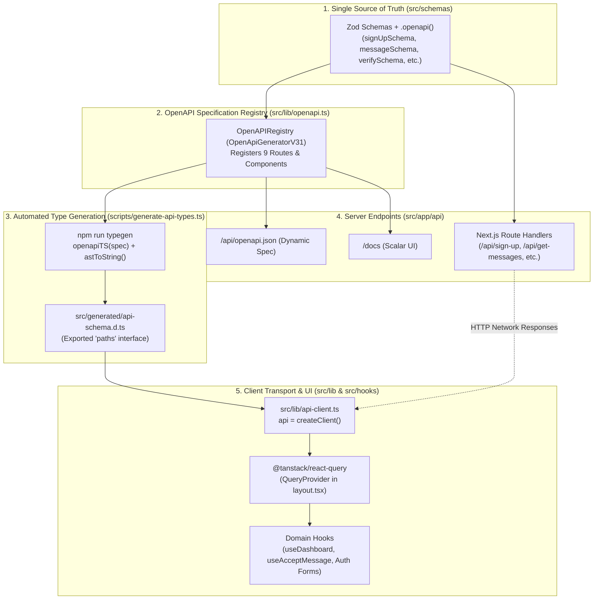

# API Architecture & End-to-End Type Safety Guide

This document details the design, implementation, and developer workflows for GhostMsg's type-safe API infrastructure, OpenAPI 3.1 contract generation, interactive documentation, and client-server communication.

---

## 1. Architectural Principles

1. **Single Source of Truth (SSoT)**: Every endpoint parameter, request payload, and status-coded response is defined using Zod schemas with `@asteasolutions/zod-to-openapi` metadata in [`src/schemas/`](file:///d:/Projects/GhostMsg/src/schemas).
2. **Zero Code Duplication**: TypeScript types for client and server are generated automatically using `openapi-typescript`. No manual interface synchronization is required.
3. **Idiomatic HTTP Client**: Axios is deprecated in favor of **`openapi-fetch`**, providing a lightweight (<5kB) type-safe SDK with native `fetch` and `AbortSignal` support.
4. **Declarative State Synchronization**: Client data fetching and mutations use **`@tanstack/react-query`** for automatic caching, background revalidation, query invalidation, and optimistic UI updates.
5. **Interactive Living Documentation**: OpenAPI 3.1 specifications are served dynamically at `/api/openapi.json` and rendered interactively via **Scalar API Reference** at `/docs`.

---

## 2. End-to-End Architecture Flow



---

## 3. OpenAPI 3.1 Specification Registry

The central registry is implemented in [`src/lib/openapi.ts`](file:///d:/Projects/GhostMsg/src/lib/openapi.ts). It defines:
- **Security Schemes**: NextAuth session cookie (`next-auth.session-token`).
- **Domain Tags**:
  1. `Authentication & Verification`: Sign-up, verify code, username uniqueness.
  2. `Anonymous Messaging`: Send message, AI suggested prompts.
  3. `Dashboard & Inbox`: Get messages, delete message, get/update message acceptance.
- **Dynamic Spec Function**: `getOpenApiSpec()` returns a standard OpenAPI 3.1 JSON document.

### Registered Operations Matrix

| Endpoint | Method | Auth Required | Request Payload / Params | Success Response | Error Responses |
| :--- | :--- | :--- | :--- | :--- | :--- |
| `/api/check-username-unique` | `GET` | No | Query: `username` | `200 OK` (UsernameUniqueResponse) | `400`, `500` |
| `/api/sign-up` | `POST` | No | Body: `SignUpRequest` | `201 Created` (SignUpResponse) | `400`, `500` |
| `/api/verify-code` | `POST` | No | Body: `VerifyCodeRequest` | `200 OK` (VerifyCodeResponse) | `400`, `404`, `500` |
| `/api/send-message` | `POST` | No | Body: `SendMessageRequest` | `200 OK` (SendMessageResponse) | `404`, `500` |
| `/api/suggest-messages` | `GET` | No (Edge) | None | `200 OK` (SuggestedMessagesResponse) | `500` |
| `/api/get-messages` | `GET` | Yes (Session) | None | `200 OK` (GetMessagesResponse) | `401`, `404`, `500` |
| `/api/delete-message/{messageId}` | `DELETE` | Yes (Session) | Path: `messageId` | `200 OK` (BaseResponse) | `401`, `404`, `500` |
| `/api/accept-message` | `GET` | Yes (Session) | None | `200 OK` (AcceptMessageGetResponse) | `401`, `404`, `500` |
| `/api/accept-message` | `POST` | Yes (Session) | Body: `AcceptMessageRequest` | `200 OK` (AcceptMessagePostResponse) | `400`, `401`, `500` |

---

## 4. Automated TypeScript Code Generation

The script [`scripts/generate-api-types.ts`](file:///d:/Projects/GhostMsg/scripts/generate-api-types.ts) transforms the OpenAPI 3.1 specification into static TypeScript definitions:

```bash
# Run on-demand during development
npm run typegen
# or
pnpm typegen
```

This generates [`src/generated/api-schema.d.ts`](file:///d:/Projects/GhostMsg/src/generated/api-schema.d.ts), declaring the `paths` interface containing all operations, parameters, request bodies, and status-coded response schemas.

> [!TIP]
> `npm run build` runs `npm run typegen` automatically before Turbopack compilation to ensure zero type drift between API schema definitions and client consumers.

---

## 5. Client Transport: `openapi-fetch` & React Query

The client SDK in [`src/lib/api-client.ts`](file:///d:/Projects/GhostMsg/src/lib/api-client.ts) is instantiated as:

```typescript
import createClient from "openapi-fetch";
import type { paths } from "@/generated/api-schema";

export const api = createClient<paths>({
  baseUrl: "",
});

export type ApiPaths = paths;
```

### Usage in React Query Hooks

#### Query Example: Fetching Messages ([`src/hooks/use-dashboard.tsx`](file:///d:/Projects/GhostMsg/src/hooks/use-dashboard.tsx))
```typescript
const { data, isLoading, refetch } = useQuery({
  queryKey: ["messages"],
  queryFn: async ({ signal }) => {
    const { data, error } = await api.GET("/api/get-messages", { signal });
    if (error || !data) {
      throw new Error(error?.message || "Failed to fetch messages");
    }
    return data;
  },
  enabled: status === "authenticated",
});
```

#### Mutation Example: Deleting Message & Invalidation
```typescript
const deleteMutation = useMutation({
  mutationFn: async (messageId: string) => {
    const { data, error } = await api.DELETE(
      "/api/delete-message/{messageId}",
      { params: { path: { messageId } } }
    );
    if (error || !data) {
      throw new Error(error?.message || "Failed to delete message");
    }
    return data;
  },
  onSuccess: () => {
    queryClient.invalidateQueries({ queryKey: ["messages"] });
    toast.success("Message deleted successfully!");
  },
});
```

---

## 6. Interactive Documentation with Scalar

- **Route Endpoints**:
  - Web UI: [`/docs`](file:///d:/Projects/GhostMsg/src/app/docs/route.ts)
  - Spec JSON: [`/api/openapi.json`](file:///d:/Projects/GhostMsg/src/app/api/openapi.json/route.ts)
- **Features**:
  - Modern purple/dark aesthetic matching GhostMsg design system.
  - Interactive "Test Request" console with session cookie support.
  - Multi-language client code generation (JavaScript, TypeScript fetch, cURL, Python, Go).

