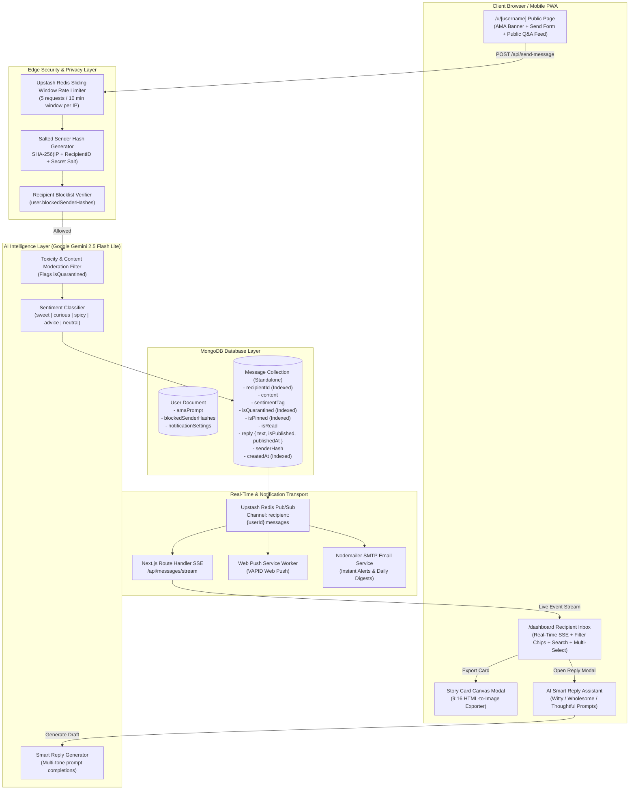
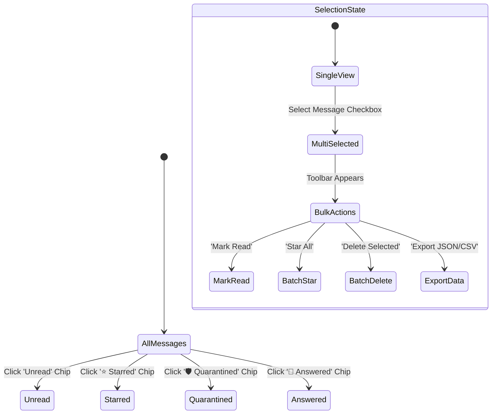
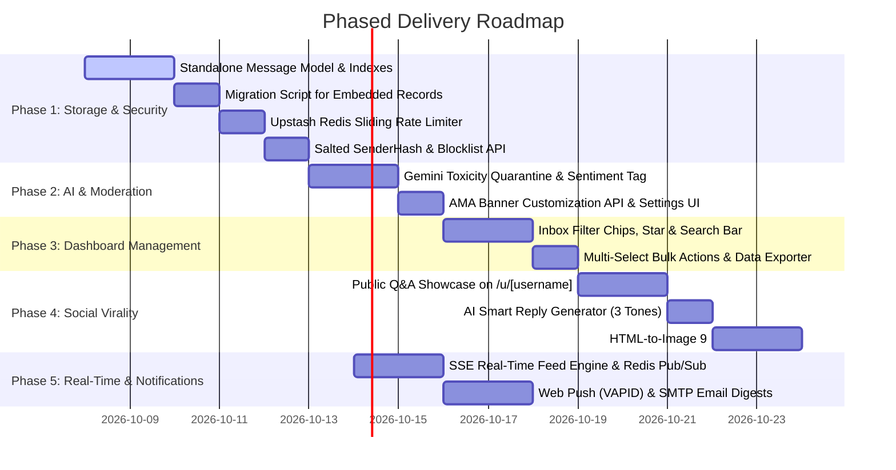

# GhostMsg: Comprehensive Feature & Implementation Blueprint 📘

This blueprint specifies the technical architecture, data structures, cryptographic algorithms, AI pipelines, API contracts, UI state machines, and implementation workflows for the expanded GhostMsg feature suite as formalized in [ADR 0010](file:///d:/Projects/GhostMsg/docs/adr/0010-standalone-messages-schema-and-feature-architecture.md).

---

## 1. Architectural Topology & System Flow



---

## 2. Data Models & Database Migration

### 2.1 Standalone `Message` Model (`src/model/message.model.ts`)

```typescript
import mongoose, { type Document, Schema, type Types } from "mongoose";

export type SentimentTag = "sweet" | "curious" | "spicy" | "advice" | "neutral";

export interface IMessageReply {
  text: string;
  isPublished: boolean;
  publishedAt?: Date;
}

export interface IMessage extends Document {
  _id: Types.ObjectId;
  recipientId: Types.ObjectId;
  content: string;
  sentimentTag: SentimentTag;
  isQuarantined: boolean;
  isPinned: boolean;
  isRead: boolean;
  reply?: IMessageReply;
  senderHash: string;
  createdAt: Date;
  updatedAt: Date;
}

const MessageReplySchema = new Schema<IMessageReply>(
  {
    text: { type: String, required: true, maxlength: 1000 },
    isPublished: { type: Boolean, default: false },
    publishedAt: { type: Date },
  },
  { _id: false }
);

const MessageSchema = new Schema<IMessage>(
  {
    recipientId: {
      type: Schema.Types.ObjectId,
      ref: "User",
      required: true,
      index: true,
    },
    content: {
      type: String,
      required: true,
      minlength: 10,
      maxlength: 300,
      trim: true,
    },
    sentimentTag: {
      type: String,
      enum: ["sweet", "curious", "spicy", "advice", "neutral"],
      default: "neutral",
      required: true,
    },
    isQuarantined: {
      type: Boolean,
      default: false,
      index: true,
    },
    isPinned: {
      type: Boolean,
      default: false,
      index: true,
    },
    isRead: {
      type: Boolean,
      default: false,
      index: true,
    },
    reply: {
      type: MessageReplySchema,
      default: null,
    },
    senderHash: {
      type: String,
      required: true,
      index: true,
    },
  },
  {
    timestamps: true,
  }
);

// Compound indexes for sub-millisecond inbox filtering & sorting
MessageSchema.index({ recipientId: 1, isQuarantined: 1, createdAt: -1 });
MessageSchema.index({ recipientId: 1, isPinned: 1, createdAt: -1 });
MessageSchema.index({ recipientId: 1, "reply.isPublished": 1, createdAt: -1 });

const MessageModel =
  (mongoose.models.Message as mongoose.Model<IMessage>) ||
  mongoose.model<IMessage>("Message", MessageSchema);

export default MessageModel;
```

### 2.2 `User` Model Updates (`src/model/user.model.ts`)

```typescript
export interface IUser extends Document {
  _id: Types.ObjectId;
  username: string;
  email: string;
  password: string;
  verifyCode: string;
  verifyCodeExpiry: Date;
  isVerified: boolean;
  isAcceptingMessage: boolean;
  amaPrompt?: string; // Custom banner text for /u/[username]
  blockedSenderHashes: string[]; // List of sender hashes blocked by this recipient
  notificationSettings: {
    emailAlerts: "instant" | "daily" | "off";
    webPushEnabled: boolean;
  };
  pushSubscriptions?: Array<{
    endpoint: string;
    keys: {
      p256dh: string;
      auth: string;
    };
  }>;
  createdAt: Date;
  updatedAt: Date;
}
```

### 2.3 Migration Script (`scripts/migrate-embedded-messages.ts`)

To ensure backward compatibility without data loss:

```typescript
import dbConnect from "@/lib/db-connect";
import UserModel from "@/model/user.model";
import MessageModel from "@/model/message.model";
import crypto from "crypto";

export async function migrateLegacyMessages() {
  await dbConnect();
  const usersWithMessages = await UserModel.find({ "messages.0": { $exists: true } });

  console.log(`Found ${usersWithMessages.length} users with legacy embedded messages.`);

  for (const user of usersWithMessages) {
    const legacyMessages = (user as any).messages || [];
    if (legacyMessages.length === 0) continue;

    const docsToInsert = legacyMessages.map((msg: any) => ({
      _id: msg._id,
      recipientId: user._id,
      content: msg.content,
      sentimentTag: "neutral",
      isQuarantined: false,
      isPinned: false,
      isRead: true,
      senderHash: crypto.createHash("sha256").update(`legacy-${user._id}`).digest("hex"),
      createdAt: msg.createdAt || new Date(),
      updatedAt: msg.createdAt || new Date(),
    }));

    await MessageModel.insertMany(docsToInsert, { ordered: false });
    await UserModel.updateOne({ _id: user._id }, { $unset: { messages: 1 } });
    console.log(`Migrated ${docsToInsert.length} messages for user: ${user.username}`);
  }

  console.log("Migration complete!");
}
```

---

## 3. Privacy-First Abuse Prevention & Rate Limiting

### 3.1 Rate Limiting via Upstash Redis Sliding Window
- **Algorithm**: Sliding window counter evaluated over a 10-minute period per client IP.
- **Threshold**: Maximum 5 messages per 10 minutes per IP address.
- **Ephemeral Storage**: Redis key `ratelimit:send-message:${ip}` with a 600-second TTL. The raw IP address is discarded immediately upon TTL expiration and is **never written to MongoDB**.

### 3.2 Salted Sender Hash & Shadowbanning
To enable recipients to block abusive individuals without storing sender identities:

$$\text{SenderHash} = \text{HMAC-SHA256}\Big(\text{Client IP} + \text{RecipientId},\;\; \text{SECRET\_PEPPER}\Big)$$

```typescript
import crypto from "crypto";

export function computeSenderHash(ip: string, recipientId: string): string {
  const secretPepper = process.env.SENDER_PEPPER_SECRET || "ghostmsg-default-secret-salt";
  return crypto
    .createHmac("sha256", secretPepper)
    .update(`${ip}:${recipientId}`)
    .digest("hex");
}
```

* **Execution Logic**:
  1. When a message is posted to `/api/send-message`, compute `senderHash`.
  2. Query `user.blockedSenderHashes.includes(senderHash)`.
  3. **If Blocked**: Respond with HTTP `200 OK` (simulating success to shadowban the attacker and avoid alerting them) but **drop the message payload silently** without saving to the database.

---

## 4. AI Processing Pipeline (Google Gemini 2.5 Flash Lite)

### 4.1 Ingestion Moderation & Sentiment Tagging (`/api/send-message`)

When a message is received, it passes through a single structured prompt to Gemini 2.5 Flash Lite:

```typescript
const prompt = `Analyze this anonymous message for an online social platform:
"${content}"

Evaluate:
1. isToxic: true if the message contains harassment, hate speech, threats, doxxing, or explicit abuse. Otherwise false.
2. sentimentTag: Select exactly one category from ["sweet", "curious", "spicy", "advice", "neutral"].
   - sweet: Compliments, praise, kindness, expressions of love or gratitude.
   - curious: Questions, probing thoughts, inquiries about life or opinions.
   - spicy: Playful roasts, daring banter, confessions, secrets.
   - advice: Constructive feedback, life suggestions, tips.
   - neutral: General greetings or plain statements.

Respond ONLY with valid JSON matching:
{"isToxic": boolean, "sentimentTag": "sweet" | "curious" | "spicy" | "advice" | "neutral"}`;
```

* **Outcome**:
  * If `isToxic: true` $\rightarrow$ set `isQuarantined: true`.
  * Store the categorized `sentimentTag`.
  * Execution completes within 250ms on Edge/Node runtime, keeping message ingestion sub-second.

### 4.2 AI Smart Reply Assistant (`/api/ai/smart-reply`)

In the recipient dashboard reply modal, users can click one of three tone buttons:
* **🔥 Witty / Roast**: Humorous, quick-witted, sarcastic banter.
* **💖 Wholesome**: Warm, grateful, uplifting, polite.
* **🤔 Thoughtful**: Deep, reflective, honest, philosophical.

```typescript
export const smartReplyPrompt = (content: string, tone: "witty" | "wholesome" | "thoughtful") => `
You are GhostMsg's AI reply assistant. The user received this anonymous message:
"${content}"

Generate a short, engaging reply (max 2 sentences, under 180 characters) matching the tone: ${tone}.
Reply directly as the recipient. Do not wrap in quotes or add preamble.
`;
```

---

## 5. Public Q&A Showcase & Social Story Card Generator

### 5.1 Public Q&A Showcase (`/u/[username]`)
* Visitors on `/u/[username]` see two primary view modes:
  1. **Send Message Tab**: Features the recipient's **AMA Prompt Banner** (e.g. *"Ask me anything about UI/UX design!"*), the message textarea, and AI prompt suggestions.
  2. **Public Answers Tab**: Displays all messages where `reply.isPublished === true`. Rendered with the question card, the recipient's response, the published timestamp, and the sentiment badge.

### 5.2 9:16 Social Story Card Generator
Built with `html-to-image` in the client browser:
* **Card Dimensions**: 1080 x 1920 px (9:16 vertical ratio).
* **Presets & Visual Themes**:
  * **Midnight Violet**: Deep indigo/purple gradient (`from-[#0f0c29] via-[#302b63] to-[#24243e]`).
  * **Cyberpunk Neon**: High-contrast dark charcoal with neon cyan/magenta border glow.
  * **Sunset Rose**: Soft warm coral-to-amber sunset palette.
  * **Minimal Monochrome**: Crisp glassmorphic frosted card with subtle noise overlay.
* **Export Actions**:
  * **Copy Image to Clipboard**: Uses `navigator.clipboard.write([new ClipboardItem({ 'image/png': blob })])` for instant pasting directly into Instagram Stories or Snapchat on mobile.
  * **Download PNG**: Direct one-tap file download.

---

## 6. Advanced Inbox Management State Machine



### 6.1 Filter Chips & Search Bar
* **Search Engine**: Sub-second client-side fuzzy match on `message.content` when in memory, backed by MongoDB text search on `/api/get-messages?q=...`.
* **Sub-Filter Chips**:
  * `All`: Shows all non-quarantined messages.
  * `Unread`: Messages where `isRead === false`.
  * `⭐ Starred`: Messages where `isPinned === true`.
  * `🛡️ Quarantined`: Messages flagged as toxic/spam, isolated from the main feed with warning badges.
  * `💬 Answered`: Messages with an active published or saved reply.

### 6.2 Bulk Export Engine
* **JSON Export**: Downloads clean `{ id, content, sentimentTag, createdAt, reply }` JSON file.
* **CSV Export**: Standard comma-separated spreadsheet format with UTF-8 encoding.
* **PDF Scrapbook**: Printable CSS layout formatting messages into a clean aesthetic grid.

---

## 7. Real-Time Engine & Push Notification Architecture

### 7.1 Server-Sent Events (SSE) Route (`/api/messages/stream`)

```typescript
import { NextRequest } from "next/server";
import { getServerSession } from "next-auth";
import { authOptions } from "@/app/api/auth/[...nextauth]/options";
import { redisSubscriber } from "@/lib/redis";

export const runtime = "nodejs";

export async function GET(req: NextRequest) {
  const session = await getServerSession(authOptions);
  if (!session?.user?._id) {
    return new Response("Unauthorized", { status: 401 });
  }

  const userId = session.user._id;
  const encoder = new TextEncoder();

  const stream = new ReadableStream({
    async start(controller) {
      const channel = `recipient:${userId}:messages`;
      
      const onMessage = (channel: string, message: string) => {
        controller.enqueue(encoder.encode(`event: new_message\ndata: ${message}\n\n`));
      };

      await redisSubscriber.subscribe(channel);
      redisSubscriber.on("message", onMessage);

      req.signal.addEventListener("abort", async () => {
        await redisSubscriber.unsubscribe(channel);
      });
    },
  });

  return new Response(stream, {
    headers: {
      "Content-Type": "text/event-stream",
      "Cache-Control": "no-cache, no-transform",
      Connection: "keep-alive",
    },
  });
}
```

### 7.2 Web Push Notification Payload (VAPID)
When a message arrives and the user is offline:
```json
{
  "title": "New Anonymous Message! 👻",
  "body": "Someone just left a new message on your profile.",
  "icon": "/icons/icon-192.png",
  "badge": "/icons/badge-72.png",
  "data": {
    "url": "/dashboard"
  }
}
```

---

## 8. Complete API Contracts & OpenAPI Operations Matrix

| Endpoint | Method | Auth | Parameters / Body | Purpose |
| :--- | :--- | :--- | :--- | :--- |
| `/api/send-message` | `POST` | Public | `{ username, content }` | Evaluates rate limit, computes `senderHash`, runs Gemini moderation & sentiment, saves message, publishes to Redis. |
| `/api/get-messages` | `GET` | Session | Query: `status`, `q`, `cursor`, `limit` | Paginated, filtered inbox retrieval. |
| `/api/messages/{messageId}` | `PATCH` | Session | `{ isPinned?, isRead? }` | Toggles message pinned or read state. |
| `/api/messages/{messageId}/reply` | `POST` | Session | `{ text, isPublished }` | Author and publish or unpublish response. |
| `/api/messages/bulk` | `POST` | Session | `{ action: 'delete'\|'read'\|'star', ids: string[] }` | Batch operations across multiple messages. |
| `/api/block-sender` | `POST` | Session | `{ senderHash }` | Adds sender hash to recipient's `blockedSenderHashes`. |
| `/api/public/{username}/answers` | `GET` | Public | Query: `cursor`, `limit` | Retrieves public Q&A feed for `/u/[username]`. |
| `/api/ai/smart-reply` | `POST` | Session | `{ content, tone: 'witty'\|'wholesome'\|'thoughtful' }` | Generates AI draft replies via Gemini. |
| `/api/user/ama-prompt` | `PATCH` | Session | `{ amaPrompt: string }` | Updates custom profile AMA banner. |
| `/api/messages/stream` | `GET` | Session | None | Server-Sent Events real-time stream. |

---

## 9. Phased Execution & Quality Verification Checklist



### Quality Guardrails
1. **Type Safety**: Execute `pnpm typegen` whenever schemas change.
2. **Linting & Code Quality**: Run `pnpm check` (Ultracite Biome) with zero suppressions.
3. **No Raw IP Persistence**: Verify no database schema contains an IP address field.
